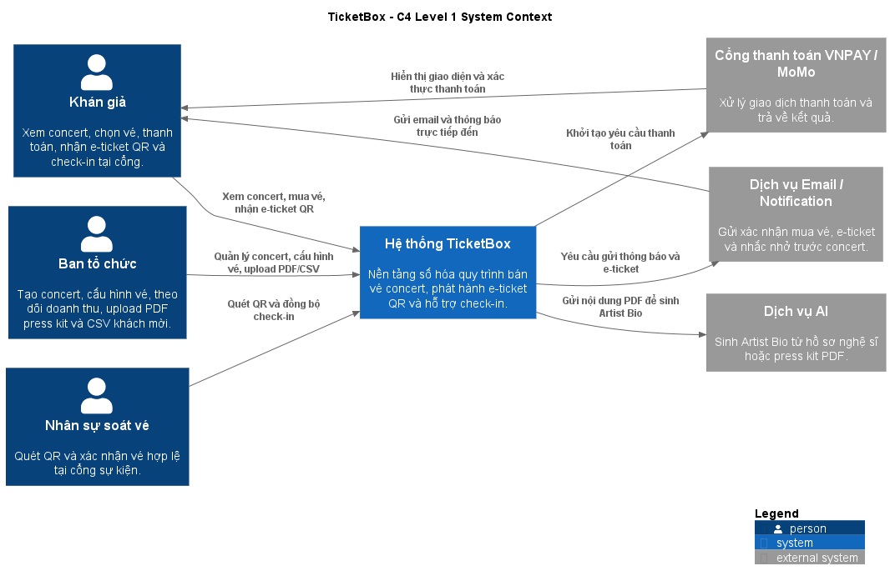
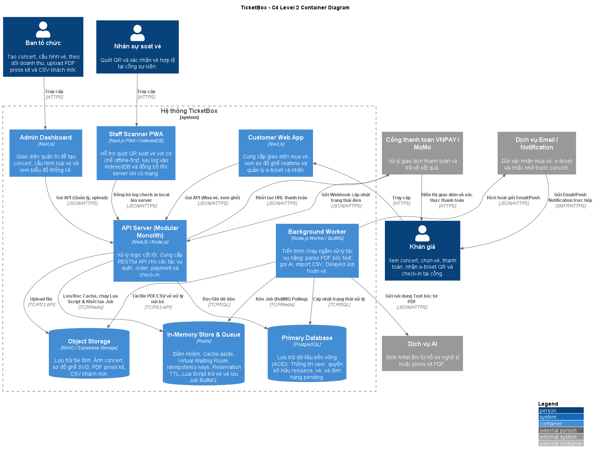
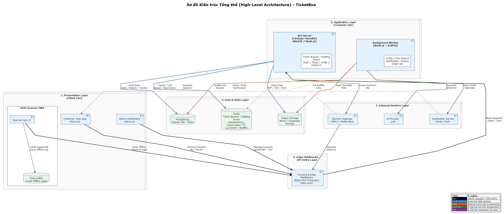

# TicketBox — Technical Design

## Mục lục

1. [Kiến trúc tổng thể](#1-kiến-trúc-tổng-thể)
2. [C4 Diagram](#2-c4-diagram)

   2.1. [Level 1 — System Context](#21-level-1--system-context)

   2.2. [Level 2 — Container](#22-level-2--container)

3. [High-Level Architecture Diagram](#3-high-level-architecture-diagram)

   3.1. [Luồng dữ liệu chính](#31-luồng-dữ-liệu-chính)

4. [Thiết kế cơ sở dữ liệu](#4-thiết-kế-cơ-sở-dữ-liệu)

   4.1. [PostgreSQL](#41-postgresql)

   4.2. [Redis](#42-redis)
   
   4.3. [Object Storage](#43-object-storage)

   4.4. [AI Artist Bio Flow](#44-ai-artist-bio-flow)

   4.5. [CSV Guest List Import Flow](#45-csv-guest-list-import-flow)

   4.6. [Notification Module](#46-notification-module)

5. [Mô tả luồng nghiệp vụ](#5-mô-tả-luồng-nghiệp-vụ)

   5.1. [Luồng mua vé từ lúc bấm "Mua vé" đến khi nhận e-ticket](#51-luồng-mua-vé-từ-lúc-bấm-mua-vé-đến-khi-nhận-e-ticket)

   5.2. [Luồng soát vé khi mất mạng và đồng bộ lại](#52-luồng-soát-vé-khi-mất-mạng-và-đồng-bộ-lại)

   5.3. [Luồng nhập danh sách khách mời từ CSV](#53-luồng-nhập-danh-sách-khách-mời-từ-csv)

6. [Thiết kế kiểm soát truy cập](#6-thiết-kế-kiểm-soát-truy-cập)

   6.1. [Nhóm người dùng](#61-nhóm-người-dùng)

   6.2. [Cách kiểm tra quyền](#62-cách-kiểm-tra-quyền)

7. [Thiết kế các cơ chế bảo vệ hệ thống](#7-thiết-kế-các-cơ-chế-bảo-vệ-hệ-thống)

   7.1. [Kiểm soát tải đột biến](#71-kiểm-soát-tải-đột-biến)

   7.2. [Xử lý cổng thanh toán không ổn định](#72-xử-lý-cổng-thanh-toán-không-ổn-định)

   7.3. [Chống trừ tiền hai lần](#73-chống-trừ-tiền-hai-lần)

   7.4. [Caching](#74-caching)

8. [Các quyết định kỹ thuật quan trọng (ADR)](#8-các-quyết-định-kỹ-thuật-quan-trọng-adr)

   8.1. [ADR 1 — Modular Monolith + Async Worker](#81-adr-1)
   
   8.2. [ADR 2 — PostgreSQL + Redis + Object Storage](#82-adr-2)

   8.3. [ADR 3 — Hybrid RBAC + Resource Ownership Check](#83-adr-3)

   8.4. [ADR 4 — Redis Lua Script cho tranh chấp vé và giới hạn per-user](#84-adr-4)

   8.5. [ADR 5 — Token Bucket + Virtual Waiting Room + Bot Protection cho tải đột biến](#85-adr-5)

   8.6. [ADR 6 — Circuit Breaker cho Payment Gateway](#86-adr-6)

   8.7. [ADR 7 — Idempotency Key cho chống trừ tiền hai lần](#87-adr-7)

   8.8. [ADR 8 — QR Signed Payload + Online Status Check](#88-adr-8)

   8.9. [ADR 9 — BullMQ + Redis cho Message Queue](#89-adr-9)

   8.10. [ADR 10 — Hybrid Reservation: Redis TTL + SQL Pending Order + Delayed Job](#810-adr-10)
   
   8.11. [ADR 11 — Asynchronous Background Jobs cho AI Bio, CSV Import và Notification](#811-adr-11)

---

## 1. Kiến trúc tổng thể

TicketBox sử dụng kiến trúc **Modular Monolith + Async Worker**.

* **Lý do lựa chọn:** 
  * Hệ thống được triển khai theo dạng Monolith để **giảm độ phức tạp** khi phát triển, debug và deploy trong phạm vi đồ án. Tuy nhiên, phần backend được chia thành các module nghiệp vụ độc lập như Auth, Concert, Ticket, Order, Payment, Check-in, Notification, AI Bio và Guest List Import. Cách tổ chức này **giúp code rõ ràng, dễ bảo trì và có thể tách dần thành Microservices trong tương lai** nếu hệ thống tăng quy mô. 
  * Các tác vụ nặng, chậm hoặc có nguy cơ timeout như gửi email, tạo QR, xử lý PDF bằng AI, import CSV khách mời và tự động hủy đơn quá hạn sẽ không chạy trực tiếp trong request chính. Thay vào đó, Backend API sẽ đẩy các công việc này vào hàng đợi BullMQ thông qua Redis, sau đó Background Worker xử lý bất đồng bộ, **giúp bảo vệ luồng chính khỏi bị nghẽn** khi hệ thống phải gánh tải nặng từ AI bóc tách text, xử lý file CSV hay gửi hàng loạt email.

Các thành phần chính của hệ thống gồm:

* **Customer Web App**: giao diện dành cho khán giả để xem concert, chọn vé, mua vé và xem e-ticket.
* **Admin Web App**: giao diện dành cho ban tổ chức để quản lý concert, loại vé, doanh thu, upload PDF/CSV.
* **Check-in PWA**: ứng dụng mobile-first dành cho nhân sự soát vé, hỗ trợ quét QR và lưu log offline.
* **Backend API**: xử lý nghiệp vụ chính, xác thực, phân quyền, đặt vé, thanh toán, check-in và quản trị.
* **Background Worker**: xử lý tác vụ nền như AI Artist Bio, CSV import, email, reminder và expire pending order.
* **PostgreSQL**: cơ sở dữ liệu chính lưu user, concert, ticket type, order, payment, ticket, check-in log.
* **Redis**: dùng cho cache, rate limiting, idempotency key, hàng đợi BullMQ, giữ chỗ vé tạm thời và Redis Lua Script.
* **Object Storage**: dùng MinIO ở local và Supabase Storage khi deploy để lưu PDF, CSV, ảnh concert và các file tĩnh.
* **Mock Payment Gateway**: mô phỏng VNPAY/MoMo trong phạm vi đồ án.
* **AI Provider**: mô hình AI dùng để sinh Artist Bio từ nội dung PDF.
* **Email/Notification Service**: gửi xác nhận mua vé, e-ticket và nhắc nhở trước concert.

Khi một thành phần gặp sự cố, hệ thống cần giảm ảnh hưởng dây chuyền:

* Nếu **AI Provider** lỗi, chức năng mua vé và xem concert vẫn hoạt động; job AI Bio có thể retry sau.
* Nếu **CSV import** lỗi, hệ thống lưu trạng thái lỗi của job và không làm gián đoạn backend chính.
* Nếu **Payment Gateway** lỗi kéo dài, Circuit Breaker tạm ngắt luồng tạo thanh toán, nhưng người dùng vẫn xem được concert và vé còn lại.
* Nếu **Worker** tạm dừng, các request chính vẫn hoạt động; các job nền sẽ được xử lý lại khi Worker chạy lại.
* Nếu **Redis** gặp sự cố, các chức năng phụ thuộc cache/rate limit/queue bị ảnh hưởng, nhưng PostgreSQL vẫn là nguồn dữ liệu chính để phục hồi trạng thái.
* Nếu **PostgreSQL** gặp sự cố, các thao tác nghiệp vụ ghi dữ liệu như mua vé, thanh toán, check-in online sẽ không thể hoàn tất vì đây là database chính.

---

## 2. C4 Diagram

### 2.1. Level 1 — System Context



### 2.2. Level 2 — Container



---

## 3. High-Level Architecture Diagram



### 3.1. Luồng dữ liệu chính

1. Khi khán giả xem danh sách hoặc chi tiết concert, Customer Web gọi Backend API. Backend ưu tiên đọc dữ liệu từ Redis cache. Nếu cache miss, Backend đọc từ PostgreSQL, ghi lại vào Redis theo cơ chế cache-aside rồi trả kết quả cho client.

2. Khi khán giả mua vé, request đi qua Edge Middleware để kiểm tra bot protection, rate limit và waiting room token. Backend tiếp tục kiểm tra idempotency key để tránh xử lý trùng request.

3. Sau đó, Backend dùng Redis Lua Script để kiểm tra tồn kho vé, kiểm tra giới hạn mua vé theo từng user và tạo reservation tạm thời bằng Redis TTL. Toàn bộ thao tác này chạy nguyên tử để tránh oversell và race condition.

4. Nếu giữ vé thành công, Backend tạo Order trạng thái `PENDING` trong PostgreSQL, tạo payment URL qua Mock VNPAY/MoMo và trả payment URL về Customer Web.

5. Sau khi người dùng thanh toán, Payment Gateway gửi webhook về Backend. Nếu webhook hợp lệ và thanh toán thành công, Backend chuyển Order sang `PAID`, phát hành Ticket QR và đẩy job gửi email/e-ticket vào BullMQ.

6. Nếu Order quá thời gian giữ chỗ mà chưa thanh toán, Background Worker xử lý Delayed Job, chuyển Order sang `EXPIRED` và hoàn lại số vé đã giữ trong Redis.

7. Khi Ban tổ chức upload PDF press kit, file được lưu vào Object Storage. Backend đẩy job vào BullMQ. Worker đọc file, tách nội dung, gọi AI Provider để sinh Artist Bio rồi lưu kết quả vào PostgreSQL.

8. Khi Ban tổ chức upload CSV khách mời, file được lưu vào Object Storage. Worker đọc CSV theo từng dòng hoặc từng chunk, validate dữ liệu, bỏ qua dòng lỗi, xử lý trùng lặp và ghi guest list hợp lệ vào PostgreSQL.

9. Khi nhân sự soát vé quét QR, Staff Scanner PWA ưu tiên gọi Backend API nếu có mạng. Nếu mất mạng, PWA xác thực signed QR payload, lưu check-in log vào IndexedDB và đồng bộ lại khi mạng phục hồi.

10. Khi đồng bộ offline check-in, Backend kiểm tra trạng thái vé trong PostgreSQL. Nếu vé chưa được dùng, hệ thống ghi nhận check-in. Nếu vé đã được check-in trước đó, hệ thống đánh dấu conflict để nhân sự xử lý.

---

## 4. Thiết kế cơ sở dữ liệu

TicketBox sử dụng kết hợp **PostgreSQL + Redis + Object Storage** để tối ưu hóa cho từng loại dữ liệu:

* **PostgreSQL** lưu dữ liệu nghiệp vụ chính cần tính nhất quán cao như user, concert, order, payment, ticket, check-in và phân quyền.
* **Redis** xử lý các dữ liệu cần tốc độ cao như cache, rate limit, waiting room, idempotency key, reservation TTL và queue.
* **Object Storage** lưu các file lớn như PDF press kit, CSV guest list, ảnh concert và SVG seat map.

### 4.1. PostgreSQL

PostgreSQL là database chính vì hệ thống có nhiều dữ liệu cần tính nhất quán cao như đơn hàng, thanh toán, vé, check-in và phân quyền. Các dữ liệu này cần transaction, unique constraint, foreign key và audit rõ ràng.

Các nhóm dữ liệu chính:

* Người dùng và phân quyền.
* Concert và thông tin sự kiện.
* Loại vé và tồn kho gốc.
* Đơn hàng và thanh toán.
* Vé đã phát hành.
* Check-in log.
* Guest list VIP.
* File upload và AI Artist Bio.

Với cơ chế giữ chỗ, TicketBox **không tạo bảng Reservation riêng**. Một `Order` ở trạng thái `PENDING` kết hợp với trường `expiresAt` đóng vai trò là reservation record trong PostgreSQL. Redis TTL chỉ là lớp giữ chỗ hiệu năng cao trong thời gian mở bán; nguồn sự thật cuối cùng vẫn là `Order PENDING` trong PostgreSQL để phục vụ audit, phục hồi và xử lý khi Redis gặp sự cố.

Schema entity chính:

```prisma
// Role represents the access level of a user in the system.
enum Role {
  CUSTOMER
  ORGANIZER
  STAFF
  ADMIN
}

// ConcertStatus tracks the lifecycle state of a concert.
enum ConcertStatus {
  DRAFT
  PUBLISHED
  SALE_OPEN
  SALE_CLOSED
  CANCELLED
  COMPLETED
}

// TicketTypeStatus indicates the availability state of a ticket type.
enum TicketTypeStatus {
  ACTIVE
  INACTIVE
  SOLD_OUT
}

// OrderStatus tracks the lifecycle of a customer order.
enum OrderStatus {
  PENDING_PAYMENT
  PAID
  EXPIRED
  CANCELLED
  PAYMENT_FAILED
  REFUNDED
}

// PaymentProvider identifies the third-party payment gateway used.
enum PaymentProvider {
  MOCK
  MOMO
  VNPAY
}

// PaymentStatus reflects the outcome of a payment transaction.
enum PaymentStatus {
  INITIATED
  SUCCESS
  FAILED
  TIMEOUT
  CANCELLED
}

// TicketStatus tracks the usage state of an individual ticket.
enum TicketStatus {
  ISSUED
  CHECKED_IN
  CANCELLED
  REFUNDED
}

// IdempotencyStatus tracks the processing state of an idempotency key.
enum IdempotencyStatus {
  PROCESSING
  COMPLETED
  FAILED
}

// CheckinStatus describes the result of a ticket check-in attempt.
enum CheckinStatus {
  SUCCESS
  INVALID_TICKET
  ALREADY_CHECKED_IN
  OFFLINE_PENDING
  REJECTED_CONFLICT
}


model User {
  id           String @id @default(uuid())
  email        String @unique
  phone        String?
  passwordHash String
  fullName     String?
  role         Role @default(CUSTOMER)

  orders             Order[]
  tickets            Ticket[]
  idempotencyKeys    IdempotencyKey[]
  ticketCounters     UserTicketCounter[]
  organizedConcerts  Concert[] @relation("OrganizerConcerts")
  checkinLogs        CheckinLog[] @relation("StaffCheckins")

  createdAt DateTime @default(now())
  updatedAt DateTime @updatedAt
}

model Concert {
  id           String @id @default(uuid())
  organizerId  String

  title        String
  slug         String @unique
  description  String?
  artistBio    String?
  venue        String

  startsAt     DateTime
  saleStartsAt DateTime?
  saleEndsAt   DateTime?

  status        ConcertStatus @default(DRAFT)
  seatMapUrl    String?
  coverImageUrl String?

  organizer        User @relation("OrganizerConcerts", fields: [organizerId], references: [id])
  ticketTypes      TicketType[]
  orders           Order[]
  tickets          Ticket[]
  checkinLogs      CheckinLog[]
  guestListEntries GuestListEntry[]
  uploadedFiles    UploadedFile[]

  createdAt DateTime @default(now())
  updatedAt DateTime @updatedAt

  @@index([status, startsAt])
  @@index([saleStartsAt, saleEndsAt])
}

model TicketType {
  id        String  @id @default(uuid())
  concertId String
  concert   Concert @relation(fields: [concertId], references: [id])

  name  String
  price Int

  totalQty    Int
  soldQty     Int @default(0)
  reservedQty Int @default(0)

  maxPerUser Int

  saleStartsAt DateTime
  saleEndsAt   DateTime?

  status TicketTypeStatus @default(ACTIVE)

  orderItems   OrderItem[]
  tickets      Ticket[]
  userCounters UserTicketCounter[]

  createdAt DateTime @default(now())
  updatedAt DateTime @updatedAt

  @@unique([concertId, name])
  @@index([concertId, status])
}

model Order {
  id     String @id @default(uuid())
  userId String
  user   User   @relation(fields: [userId], references: [id])

  concertId String
  concert   Concert @relation(fields: [concertId], references: [id])

  status OrderStatus @default(PENDING_PAYMENT)

  totalAmountInVnd Int
  currency         String @default("VND")

  expiresAt           DateTime?
  paidAt              DateTime?
  cancelledAt         DateTime?
  inventoryReleasedAt DateTime?
  releaseReason       String?

  items          OrderItem[]
  payments       PaymentTransaction[]
  tickets        Ticket[]
  idempotencyKey IdempotencyKey?

  createdAt DateTime @default(now())
  updatedAt DateTime @updatedAt

  @@index([userId, status])
  @@index([concertId, status])
  @@index([status, expiresAt])
}

model OrderItem {
  id           String @id @default(uuid())
  orderId      String
  ticketTypeId String

  order      Order      @relation(fields: [orderId], references: [id])
  ticketType TicketType @relation(fields: [ticketTypeId], references: [id])

  quantity     Int
  unitPrice    Int
  subtotal     Int

  tickets Ticket[]

  createdAt DateTime @default(now())

  @@index([orderId])
  @@index([ticketTypeId])
}


model PaymentTransaction {
  id      String @id @default(uuid())
  orderId String
  order   Order  @relation(fields: [orderId], references: [id])

  provider PaymentProvider
  status   PaymentStatus @default(INITIATED)

  amount Int

  providerTransactionId String?

  paymentUrl String?
  rawWebhook Json?

  receivedAt DateTime?
  createdAt  DateTime @default(now())
  updatedAt  DateTime @updatedAt

  @@unique([provider, providerTransactionId])
  @@index([orderId, status])
}

model Ticket {
  id           String @id @default(uuid())
  orderId      String
  orderItemId  String
  concertId    String
  ticketTypeId String
  userId       String

  order      Order      @relation(fields: [orderId], references: [id])
  orderItem  OrderItem  @relation(fields: [orderItemId], references: [id])
  concert    Concert    @relation(fields: [concertId], references: [id])
  ticketType TicketType @relation(fields: [ticketTypeId], references: [id])
  user       User       @relation(fields: [userId], references: [id])

  qrTokenHash String @unique
  qrSignature String?

  status      TicketStatus @default(ISSUED)
  checkedInAt DateTime?

  checkinLogs CheckinLog[]

  createdAt DateTime @default(now())
  updatedAt DateTime @updatedAt

  @@index([orderId])
  @@index([concertId, status])
  @@index([ticketTypeId, status])
  @@index([userId, status])
}

model IdempotencyKey {
  id     String @id @default(uuid())
  userId String
  user   User   @relation(fields: [userId], references: [id])

  key         String
  requestHash String

  status IdempotencyStatus @default(PROCESSING)

  resourceType String?
  orderId      String? @unique
  order        Order?  @relation(fields: [orderId], references: [id])

  responseBody Json?

  expiresAt DateTime

  createdAt DateTime @default(now())
  updatedAt DateTime @updatedAt

  @@unique([userId, key])
  @@index([expiresAt])
}

model UserTicketCounter {
  userId       String
  ticketTypeId String

  user       User       @relation(fields: [userId], references: [id])
  ticketType TicketType @relation(fields: [ticketTypeId], references: [id])

  paidQty     Int @default(0)
  reservedQty Int @default(0)

  updatedAt DateTime @updatedAt

  @@id([userId, ticketTypeId])
}

model CheckinLog {
  id        String @id @default(uuid())
  ticketId  String?
  staffId   String
  concertId String?

  ticket  Ticket?  @relation(fields: [ticketId], references: [id])
  staff   User     @relation("StaffCheckins", fields: [staffId], references: [id])
  concert Concert? @relation(fields: [concertId], references: [id])

  deviceId String
  gate     String?

  offlineEventId String?

  status    CheckinStatus
  reason    String?
  isOffline Boolean @default(false)
  conflict  Boolean @default(false)

  scannedAt DateTime
  syncedAt  DateTime?

  createdAt DateTime @default(now())

  @@unique([deviceId, offlineEventId])
  @@index([ticketId])
  @@index([staffId])
  @@index([concertId])
  @@index([scannedAt])
}

model GuestListEntry {
  id        String @id @default(uuid())
  concertId String
  concert   Concert @relation(fields: [concertId], references: [id])

  fullName    String
  email       String?
  phone       String?
  sponsorName String?

  qrTokenHash String?
  qrSignature String?

  checkedInAt DateTime?

  sourceFile String?

  createdAt DateTime @default(now())
  updatedAt DateTime @updatedAt

  @@index([concertId])
  @@index([email])
  @@index([phone])
}

model UploadedFile {
  id        String  @id @default(uuid())
  concertId String?
  concert   Concert? @relation(fields: [concertId], references: [id])

  objectKey    String
  fileName     String
  mimeType     String
  purpose      String
  status       String
  errorMessage String?

  createdAt DateTime @default(now())

  @@index([concertId])
  @@index([purpose])
}
```

### 4.2. Redis

Redis được dùng cho dữ liệu cần tốc độ cao, không thay thế PostgreSQL:

* Cache danh sách concert.
* Cache chi tiết concert.
* Micro-cache số vé còn lại.
* Token Bucket Rate Limiting.
* Idempotency Key.
* Waiting Room Token.
* Redis Lua Script giữ vé và enforce giới hạn per-user.
* BullMQ queue.
* Redis TTL cho reservation tạm thời.

Ví dụ key:

```txt
cache:concert:list
cache:concert:detail:{concertId}
cache:ticket-availability:{concertId}
cache:artist-bio:{concertId}
cache:seatmap:{concertId}

rate-limit:{userId}:{route}
rate-limit:{ip}:{route}

idem:{userId}:{idempotencyKey}

waiting-room:token:{token}
waiting-room:position:{concertId}:{userId}

stock:{ticketTypeId}
user-limit:{userId}:{ticketTypeId}
reservation:{orderId}

queue:ai-bio
queue:csv-import
queue:notification
queue:order-expire
```

### 4.3. Object Storage

Object Storage dùng để lưu file lớn:

* PDF press kit.
* CSV guest list.
* Ảnh concert.
* SVG seat map.
* File xuất báo cáo nếu có.

Local dùng MinIO, deploy dùng Supabase Storage.

Không lưu file lớn trực tiếp vào PostgreSQL để tránh làm database phình to và giảm hiệu năng. PostgreSQL chỉ lưu metadata của file thông qua bảng `UploadedFile`, còn nội dung file thật được lưu trong Object Storage bằng `objectKey`.

### 4.4. AI Artist Bio Flow

AI Artist Bio được xử lý bất đồng bộ bằng Worker để tránh làm request upload PDF bị timeout.

Luồng xử lý:

1. Organizer upload PDF press kit lên Backend.
2. Backend lưu file vào Object Storage.
3. Backend tạo record `UploadedFile` với `purpose = "ARTIST_PRESS_KIT"` và `status = "PENDING"`.
4. Backend đẩy job vào BullMQ.
5. Worker đọc file PDF từ Object Storage.
6. Worker extract text từ PDF.
7. Worker làm sạch nội dung, loại bỏ phần nhiễu hoặc metadata không cần thiết.
8. Worker gửi nội dung đã xử lý sang AI Service.
9. AI Service sinh Artist Bio ngắn gọn.
10. Worker lưu kết quả vào `Concert.artistBio`.
11. Worker cập nhật trạng thái file thành `COMPLETED` hoặc `FAILED`.

Cách này giúp luồng upload phản hồi nhanh cho Admin, đồng thời các tác vụ nặng như đọc PDF và gọi AI không làm nghẽn Backend API chính.

### 4.5. CSV Guest List Import Flow

Guest list VIP được nhập từ file CSV do nhãn hàng gửi theo lịch cố định. Vì hệ thống nhãn hàng không có API, TicketBox xử lý file CSV theo batch thông qua BullMQ Worker.

Luồng xử lý:

1. Admin hoặc scheduled job upload/đọc file CSV guest list.
2. Backend lưu file vào Object Storage.
3. Backend tạo record `UploadedFile` với `purpose = "GUEST_LIST_CSV"` và `status = "PENDING"`.
4. Backend đẩy job import CSV vào BullMQ.
5. Worker đọc CSV theo từng batch.
6. Worker validate từng dòng dữ liệu.
7. Dòng hợp lệ được insert hoặc update vào `GuestListEntry`.
8. Dòng lỗi được ghi vào import report.
9. Sau khi xử lý xong, Worker cập nhật trạng thái file thành `COMPLETED`, `COMPLETED_WITH_ERRORS` hoặc `FAILED`.

Các lỗi cần xử lý:

* Thiếu họ tên.
* Email sai định dạng.
* Số điện thoại sai định dạng.
* Dòng bị duplicate.
* File CSV sai format.
* File rỗng hoặc không đọc được.

Các dòng hợp lệ vẫn được xử lý bình thường, không vì một vài dòng lỗi mà làm gián đoạn toàn bộ quá trình import.

### 4.6. Notification Module

TicketBox sử dụng Notification Module chạy bất đồng bộ thông qua BullMQ. Module này giúp gửi thông báo mà không làm chậm luồng mua vé hoặc luồng quản trị.

Các event chính:

* `OrderPaid`: gửi email xác nhận mua vé thành công và e-ticket QR.
* `ConcertReminder24h`: gửi nhắc nhở trước concert 24 giờ.
* `CSVImportCompleted`: thông báo kết quả import guest list cho Organizer/Admin.
* `ArtistBioGenerated`: thông báo khi AI Artist Bio đã được sinh xong.
* `OrderExpired`: thông báo nếu đơn hàng giữ chỗ hết hạn mà chưa thanh toán.

Email là notification channel mặc định. Trong tương lai có thể bổ sung SMS, Zalo OA hoặc push notification bằng cách triển khai thêm Notification Provider mới mà không cần thay đổi lớn trong logic nghiệp vụ.

---
## 5. Mô tả luồng nghiệp vụ

### 5.1. Luồng mua vé từ lúc bấm “Mua vé” đến khi nhận e-ticket

#### Mục tiêu

Luồng này đảm bảo người dùng mua vé an toàn trong điều kiện tải cao, tránh oversell, tránh tạo order trùng, đồng thời vẫn phát hành e-ticket và gửi email bất đồng bộ để không làm chậm request chính.

#### Thành phần tham gia

* **Customer Web App**: giao diện để người dùng chọn vé, nhập thông tin và bấm mua.
* **Edge Middleware / API Gateway**: lớp bảo vệ đầu vào, kiểm tra bot protection, rate limit và waiting room token.
* **Backend API**: xử lý validate nghiệp vụ, tạo order, tạo payment transaction và nhận webhook thanh toán.
* **Redis**: lưu rate limit, waiting room token, idempotency key, stock theo ticket type, per-user counter và reservation TTL.
* **Redis Lua Script**: xử lý nguyên tử bước giữ vé để tránh race condition.
* **PostgreSQL**: lưu order, order item, payment transaction, ticket và audit trail.
* **Mock Payment Gateway / VNPAY / MoMo**: xử lý bước thanh toán ngoài hệ thống.
* **BullMQ + Worker**: xử lý expire order, phát hành e-ticket, gửi email và notification.
* **Email/Notification Service**: gửi email xác nhận và e-ticket cho người mua.
* **Object Storage**: có thể lưu ảnh, template hoặc asset liên quan đến e-ticket nếu cần.

#### Các bước xử lý chính

1. **Người dùng chọn concert, chọn loại vé và bấm “Mua vé”.**
   * Customer Web gửi request tạo order đến Backend API.
   * Request kèm JWT nếu user đã đăng nhập và kèm `Idempotency-Key` để chống double-click hoặc retry ngoài ý muốn.

2. **Lớp bảo vệ đầu vào kiểm tra tính hợp lệ của request.**
   * Edge Middleware hoặc Backend kiểm tra rate limit theo IP/user/route.
   * Nếu concert đang mở bán đông, hệ thống kiểm tra waiting room token.
   * Nếu request vi phạm ngưỡng hoặc token không hợp lệ, request bị chặn trước khi vào logic giữ vé.

3. **Backend kiểm tra idempotency key.**
   * Backend tra Redis với key dạng `idem:{userId}:{idempotencyKey}`.
   * Nếu key chưa tồn tại, backend ghi trạng thái `PROCESSING` và tiếp tục.
   * Nếu key đã tồn tại và request trước đã hoàn tất, backend trả lại kết quả cũ thay vì tạo order mới.
   * Nếu key đang ở trạng thái xử lý, backend trả thông báo request đang được xử lý để tránh tạo giao dịch trùng.

4. **Backend validate dữ liệu nghiệp vụ trước khi giữ vé.**
   * Kiểm tra concert có tồn tại không.
   * Kiểm tra concert đã mở bán chưa, đã đóng bán chưa, có bị hủy không.
   * Kiểm tra ticket type có thuộc concert đó không, có đang `ACTIVE` không.
   * Kiểm tra số lượng user yêu cầu có hợp lệ không.

5. **Backend gọi Redis Lua Script để giữ vé nguyên tử.**
   * Lua Script đọc stock hiện tại của từng `ticketTypeId`.
   * Kiểm tra số lượng còn lại.
   * Kiểm tra giới hạn mua vé theo user.
   * Nếu hợp lệ, script trừ stock Redis, tăng counter per-user và tạo `reservation:{orderId}` với TTL.
   * Bước này chạy nguyên tử trong Redis nên tránh được oversell và race condition khi nhiều người mua cùng lúc.

6. **Backend tạo order `PENDING_PAYMENT` trong PostgreSQL.**
   * Backend ghi `Order` với `expiresAt` là thời điểm hết hạn giữ chỗ.
   * Backend ghi các `OrderItem` tương ứng với từng loại vé và số lượng.
   * Backend ghi `PaymentTransaction` ở trạng thái `INITIATED`.
   * Backend liên kết order với idempotency key để có thể trả kết quả cũ nếu client retry.

7. **Backend tạo payment URL và trả về frontend.**
   * Backend gọi Mock Payment Gateway hoặc provider tương ứng.
   * Provider trả payment URL.
   * Backend cập nhật payment transaction và lưu response cần thiết.
   * Customer Web chuyển người dùng sang trang thanh toán.

8. **Người dùng thanh toán trên cổng thanh toán.**
   * Trong thời gian này, Redis reservation TTL và `Order.expiresAt` vẫn đang giữ chỗ vé.
   * Nếu user hoàn tất thanh toán trong thời gian giữ chỗ, gateway sẽ gửi webhook về Backend.

9. **Backend nhận webhook và xác minh thanh toán.**
   * Backend verify chữ ký webhook.
   * Tìm payment transaction theo `providerTransactionId` hoặc `orderId`.
   * Nếu webhook hợp lệ và order còn `PENDING_PAYMENT`, backend cập nhật payment sang `SUCCESS` và order sang `PAID`.
   * Nếu webhook bị gửi lặp, hệ thống dùng unique constraint và trạng thái order để bỏ qua xử lý trùng.

10. **Backend phát hành vé điện tử.**
    * Sau khi order chuyển `PAID`, hệ thống tạo các bản ghi `Ticket` tương ứng với từng vé đã mua.
    * Mỗi ticket có `qrTokenHash`, `qrSignature`, trạng thái `ISSUED`.
    * Backend đồng thời cập nhật các số liệu tồn kho bền vững trong PostgreSQL như `soldQty`, `reservedQty` và các counter cần thiết.

11. **Backend đẩy job gửi e-ticket và thông báo sang Worker.**
    * Worker dựng nội dung email xác nhận.
    * Worker đính kèm hoặc nhúng e-ticket QR.
    * Worker gửi email qua Notification Service.
    * Khi gửi thành công, người dùng nhận e-ticket trong email và có thể xem lại trong Customer Web.

12. **Worker hoặc cron xử lý order hết hạn nếu thanh toán không hoàn tất.**
    * BullMQ delayed job kiểm tra các order `PENDING_PAYMENT` quá hạn.
    * Nếu order hết hạn mà chưa thanh toán, backend chuyển order sang `EXPIRED`.
    * Hệ thống hoàn lại stock Redis, giảm counter tạm và cập nhật trạng thái release trong PostgreSQL.

#### Hệ thống phản ứng khi có lỗi giữa chừng

* **Lỗi rate limit / waiting room / bot protection**:
  * Request bị chặn ngay từ đầu.
  * Không tạo order, không giữ vé, không phát sinh giao dịch thanh toán.
  * Frontend hiển thị thông báo chờ, thử lại hoặc quay lại hàng đợi.

* **Lỗi idempotency key trùng**:
  * Backend trả lại kết quả cũ hoặc trạng thái đang xử lý.
  * Không tạo order hoặc payment transaction mới.

* **Lỗi validate nghiệp vụ**:
  * Ví dụ concert chưa mở bán, ticket type không hợp lệ, vượt giới hạn mua vé.
  * Backend trả lỗi nghiệp vụ rõ ràng và dừng flow trước bước giữ vé.

* **Lỗi giữ vé trong Redis Lua Script**:
  * Nếu hết vé hoặc vượt giới hạn per-user, script trả lỗi cụ thể.
  * Không tạo order trong PostgreSQL.
  * Người dùng có thể chọn lại số lượng hoặc loại vé khác.

* **Lỗi sau khi Redis đã giữ vé nhưng trước khi lưu order vào PostgreSQL**:
  * Đây là lỗi cần rollback hoặc auto-recovery.
  * Backend phải xóa reservation Redis hoặc để TTL tự hết hạn nếu không thể rollback ngay.
  * Vì PostgreSQL là nguồn dữ liệu chính, order không được xem là hợp lệ nếu chưa ghi thành công vào database.

* **Lỗi tạo payment URL**:
  * Nếu payment gateway timeout hoặc bị Circuit Breaker chặn, backend có thể giữ order ở trạng thái `PENDING_PAYMENT` trong thời gian ngắn hoặc hủy luôn tùy chính sách triển khai.
  * Nếu không thể tiếp tục thanh toán, hệ thống cho order tự hết hạn và trả tồn kho sau TTL.
  * Frontend hiển thị thông báo cổng thanh toán đang gián đoạn.

* **User thoát giữa chừng hoặc không thanh toán**:
  * Order giữ trạng thái `PENDING_PAYMENT` đến khi hết hạn.
  * Delayed job hoặc cron sẽ expire order và trả vé về kho.

* **Webhook thanh toán đến chậm hoặc bị gửi lặp**:
  * Nếu thanh toán đến khi order chưa expire, backend vẫn có thể xử lý thành `PAID`.
  * Nếu webhook lặp, hệ thống bỏ qua nhờ unique constraint và kiểm tra trạng thái order.
  * Nếu webhook không đến, cronjob verify có thể kiểm tra lại trạng thái thanh toán.

* **Lỗi khi phát hành ticket hoặc gửi email**:
  * Phần phát hành ticket và gửi email nên được xử lý theo job có retry.
  * Nếu email lỗi, order vẫn là `PAID` và ticket vẫn tồn tại; worker retry gửi lại.
  * Người dùng vẫn có thể xem e-ticket trong Customer Web dù email chưa đến.

---

### 5.2. Luồng soát vé khi mất mạng và đồng bộ lại

#### Mục tiêu

Luồng này cho phép nhân sự soát vé tiếp tục làm việc khi mất kết nối mạng, vẫn xác thực được QR ở mức cơ bản, lưu được log cục bộ và đồng bộ lại khi thiết bị có mạng trở lại.

#### Thành phần tham gia

* **Check-in PWA**: ứng dụng mobile-first chạy trên thiết bị của staff.
* **Camera / QR Scanner**: đọc mã QR từ e-ticket.
* **Local Storage / IndexedDB**: lưu log quét vé offline trên thiết bị.
* **Signed QR Payload**: dữ liệu QR có chữ ký để xác minh offline.
* **Backend API**: nhận request check-in online và request sync offline log.
* **PostgreSQL**: lưu trạng thái ticket và check-in log chính thức.
* **Auth Module**: xác thực staff bằng JWT.
* **Conflict Detection Logic**: phát hiện vé đã check-in ở nơi khác hoặc bị trùng khi sync.

#### Các bước xử lý chính

1. **Staff đăng nhập vào Check-in PWA trước ca làm việc.**
   * Thiết bị nhận JWT hợp lệ.
   * PWA có thể đồng bộ trước một số metadata cần thiết như thông tin concert, cổng soát vé và khóa xác minh chữ ký nếu kiến trúc cho phép.

2. **Staff quét QR của người tham dự.**
   * Ứng dụng dùng camera đọc payload từ mã QR.
   * QR chứa thông tin nhận diện vé và chữ ký số hoặc token đã được backend ký trước đó.

3. **Nếu thiết bị có mạng, PWA ưu tiên check-in online.**
   * PWA gửi request `POST /checkin/scan` đến Backend.
   * Backend kiểm tra JWT staff, tra ticket trong PostgreSQL, kiểm tra ticket có hợp lệ không, đã `CHECKED_IN` chưa, có thuộc đúng concert không.
   * Nếu hợp lệ, backend ghi `CheckinLog` trạng thái `SUCCESS`, cập nhật `Ticket.status = CHECKED_IN`, lưu `checkedInAt` và trả kết quả cho PWA.

4. **Nếu thiết bị mất mạng, PWA chuyển sang chế độ offline.**
   * PWA không gọi được Backend API.
   * Ứng dụng xác minh chữ ký của QR payload bằng khóa public hoặc cơ chế verify đã chuẩn bị trước.
   * Nếu QR có chữ ký hợp lệ và payload đúng format, PWA coi vé là tạm hợp lệ ở mức offline.

5. **PWA ghi nhận check-in offline vào bộ nhớ cục bộ.**
   * Ứng dụng tạo một bản ghi offline gồm các trường như `offlineEventId`, `ticketId` hoặc mã vé, `deviceId`, `staffId`, `gate`, `scannedAt`, `isOffline = true`.
   * Bản ghi được lưu vào IndexedDB để không mất dữ liệu khi reload ứng dụng hoặc đóng tab.
   * PWA đánh dấu vé vừa quét là đã xử lý cục bộ để hạn chế quét lặp trên cùng thiết bị.

6. **Staff tiếp tục quét các vé khác khi không có mạng.**
   * Mỗi lượt quét hợp lệ được thêm vào hàng chờ đồng bộ.
   * Nếu cùng một QR bị quét lại trên cùng thiết bị, PWA có thể cảnh báo local duplicate ngay ở client.

7. **Khi có mạng trở lại, PWA bắt đầu đồng bộ các check-in offline.**
   * PWA gửi batch hoặc từng bản ghi đến endpoint `POST /checkin/sync`.
   * Mỗi record giữ nguyên `offlineEventId` và `deviceId` để backend deduplicate.

8. **Backend xử lý từng record offline khi sync.**
   * Xác thực JWT staff.
   * Kiểm tra `offlineEventId` + `deviceId` đã từng được sync chưa.
   * Verify ticket có tồn tại không, có đúng concert không, trạng thái hiện tại là gì.
   * Nếu ticket chưa từng được check-in, backend ghi `CheckinLog` với `SUCCESS`, cập nhật ticket sang `CHECKED_IN`.
   * Nếu ticket đã được check-in trước đó ở nơi khác, backend vẫn ghi log nhưng đánh dấu `conflict = true` hoặc `status = REJECTED_CONFLICT` tùy rule nghiệp vụ.

9. **PWA nhận kết quả sync và cập nhật trạng thái local.**
   * Record sync thành công được đánh dấu đã đồng bộ.
   * Record conflict được hiển thị cho staff hoặc supervisor để xử lý.
   * Record lỗi tạm thời có thể tiếp tục retry ở lần sync sau.

#### Hệ thống phản ứng khi có lỗi giữa chừng

* **Không có mạng ngay lúc scan**:
  * PWA tự chuyển sang offline mode.
  * Không dừng quy trình soát vé hoàn toàn.
  * Chỉ giảm mức đảm bảo từ kiểm tra trạng thái online sang xác minh chữ ký offline.

* **QR sai chữ ký hoặc payload hỏng**:
  * PWA từ chối check-in ngay cả khi offline.
  * Không lưu log hợp lệ cho vé đó.
  * Staff được cảnh báo vé không hợp lệ.

* **Quét trùng trên cùng thiết bị khi đang offline**:
  * PWA kiểm tra local cache/IndexedDB và cảnh báo đã quét trước đó.
  * Không cần tạo thêm nhiều offline log giống nhau nếu rule nghiệp vụ chọn chặn duplicate local.

* **Hai cổng khác nhau đều offline và cùng quét một vé**:
  * Hệ thống không thể phát hiện ngay tại thời điểm quét nếu không có mạng.
  * Khi sync lại, backend phát hiện ticket đã được check-in trước đó và đánh dấu conflict.
  * Ban tổ chức cần có quy trình xử lý xung đột sau đó.

* **Mất dữ liệu local trên thiết bị**:
  * Nếu staff xóa dữ liệu trình duyệt hoặc thiết bị lỗi trước khi sync, các log offline chưa đồng bộ có thể mất.
  * Đây là rủi ro vận hành cần giảm bằng cách đồng bộ lại sớm khi có mạng.

* **Sync thất bại giữa chừng**:
  * PWA giữ lại các record chưa sync thành công trong IndexedDB.
  * Khi có mạng lại, ứng dụng retry.
  * Backend dùng `deviceId + offlineEventId` để tránh ghi trùng nếu cùng record được gửi lại nhiều lần.

* **Backend lỗi khi sync một phần batch**:
  * Các record thành công vẫn được ghi nhận.
  * Các record lỗi được trả kết quả riêng để client retry chọn lọc.
  * Không nên rollback cả batch nếu một vài record lỗi riêng lẻ.

---

### 5.3. Luồng nhập danh sách khách mời từ CSV

#### Mục tiêu

Luồng này cho phép Organizer hoặc Admin nhập danh sách khách mời số lượng lớn từ file CSV theo cơ chế bất đồng bộ, có thể chịu lỗi từng dòng, không làm treo request upload và vẫn tạo được báo cáo kết quả import.

#### Thành phần tham gia

* **Admin Web App**: giao diện để organizer/admin upload file CSV.
* **Backend API**: nhận file upload, kiểm tra quyền, lưu metadata và tạo job import.
* **Object Storage**: lưu file CSV gốc.
* **PostgreSQL**: lưu metadata file upload, guest list entries và trạng thái xử lý.
* **BullMQ**: xếp hàng job import.
* **Background Worker**: đọc CSV, validate dữ liệu, insert/update từng dòng.
* **Notification Service**: gửi thông báo hoàn tất import.
* **Import Report**: báo cáo số dòng thành công, lỗi, duplicate và lý do lỗi.

#### Các bước xử lý chính

1. **Organizer hoặc Admin chọn file CSV và bấm upload.**
   * Frontend gửi file cùng `concertId` hoặc ngữ cảnh concert đến Backend.
   * Request phải qua xác thực JWT và kiểm tra role phù hợp.

2. **Backend kiểm tra quyền và validate file đầu vào.**
   * Kiểm tra user có quyền upload guest list cho concert đó không.
   * Kiểm tra định dạng file, kích thước file và MIME type cơ bản.
   * Nếu file không đạt điều kiện tối thiểu, backend trả lỗi ngay và không tạo job.

3. **Backend lưu file CSV vào Object Storage.**
   * File được gắn `objectKey` duy nhất.
   * Backend tạo bản ghi `UploadedFile` trong PostgreSQL với `purpose = "GUEST_LIST_CSV"`, `status = "PENDING"`, lưu tên file, mime type và concert liên quan.

4. **Backend đẩy job import vào BullMQ và trả phản hồi sớm cho frontend.**
   * Frontend nhận thông báo upload thành công và biết rằng import đang được xử lý nền.
   * Người dùng không cần chờ toàn bộ file được xử lý ngay trong request HTTP.

5. **Worker lấy job import CSV từ queue.**
   * Worker đọc file từ Object Storage.
   * Nếu file không đọc được hoặc object không tồn tại, job bị đánh dấu lỗi và `UploadedFile.status` chuyển `FAILED`.

6. **Worker parse CSV theo batch hoặc stream.**
   * Mỗi dòng được chuẩn hóa dữ liệu như trim khoảng trắng, normalize email/số điện thoại nếu cần.
   * Worker không đọc toàn bộ file cực lớn vào RAM nếu có thể stream hoặc chunk.

7. **Worker validate từng dòng.**
   * Kiểm tra họ tên có tồn tại không.
   * Kiểm tra email có đúng định dạng không nếu được cung cấp.
   * Kiểm tra số điện thoại có đúng định dạng không nếu được cung cấp.
   * Kiểm tra duplicate trong chính file hoặc duplicate với dữ liệu đã tồn tại theo rule nghiệp vụ.
   * Dòng không hợp lệ được ghi vào import report cùng lý do lỗi.

8. **Worker insert hoặc update dữ liệu hợp lệ vào `GuestListEntry`.**
   * Các dòng hợp lệ được lưu vào PostgreSQL.
   * Tùy rule, hệ thống có thể upsert theo email/phone hoặc thêm mới hoàn toàn.
   * Nếu có hỗ trợ guest QR trước, worker cũng có thể chuẩn bị dữ liệu QR cho khách mời.

9. **Worker tổng hợp kết quả import.**
   * Đếm tổng số dòng.
   * Đếm số dòng thành công.
   * Đếm số dòng lỗi.
   * Đếm số dòng duplicate hoặc bị bỏ qua.
   * Tạo báo cáo import để organizer/admin theo dõi.

10. **Worker cập nhật trạng thái cuối cùng và gửi thông báo.**
    * Nếu tất cả dòng thành công: `UploadedFile.status = COMPLETED`.
    * Nếu có cả dòng thành công và lỗi: `UploadedFile.status = COMPLETED_WITH_ERRORS`.
    * Nếu toàn bộ job thất bại: `UploadedFile.status = FAILED`.
    * Worker đẩy event `CSVImportCompleted` sang Notification Module để gửi email hoặc thông báo trong hệ thống.

#### Hệ thống phản ứng khi có lỗi giữa chừng

* **Sai quyền truy cập**:
  * Backend trả `403 Forbidden`.
  * Không lưu file, không tạo job.

* **File sai định dạng hoặc rỗng**:
  * Backend có thể chặn ngay từ đầu nếu nhận biết được lỗi cơ bản.
  * Nếu lỗi chỉ phát hiện khi worker parse, job bị đánh dấu `FAILED` và có error message rõ ràng.

* **Lưu file vào Object Storage thất bại**:
  * Backend trả lỗi upload thất bại.
  * Không tạo `UploadedFile` hợp lệ hoặc không enqueue job nếu file chưa được lưu thành công.

* **Enqueue job thất bại sau khi file đã lưu**:
  * Backend cần đánh dấu `UploadedFile` ở trạng thái lỗi hoặc retry enqueue.
  * File gốc vẫn còn trong Object Storage để có thể reprocess sau.

* **Worker chết giữa chừng**:
  * BullMQ có thể retry job theo cấu hình backoff.
  * Nếu retry vẫn thất bại, job vào trạng thái failed và `UploadedFile.status` phản ánh lỗi.

* **Một số dòng dữ liệu lỗi**:
  * Không làm hỏng toàn bộ job import.
  * Các dòng hợp lệ vẫn được insert/update bình thường.
  * Các dòng lỗi được ghi vào report để người dùng sửa file và import lại.

* **Lỗi database khi ghi một phần dữ liệu**:
  * Worker nên xử lý theo batch nhỏ để khoanh vùng lỗi.
  * Batch lỗi có thể retry hoặc ghi nhận thất bại cục bộ.
  * Không nhất thiết rollback toàn bộ file nếu rule cho phép partial success.

* **Duplicate dữ liệu**:
  * Worker xác định theo rule nghiệp vụ và quyết định bỏ qua, cập nhật hoặc đánh dấu lỗi.
  * Kết quả duplicate phải xuất hiện rõ trong báo cáo import.

* **Thông báo hoàn tất import gửi lỗi**:
  * Import vẫn được xem là hoàn thành nếu dữ liệu đã ghi xong.
  * Notification job có thể retry riêng, không ảnh hưởng trạng thái import chính.

## 6. Thiết kế kiểm soát truy cập

Hệ thống sử dụng mô hình **Hybrid RBAC + Resource Ownership Check**.

### 6.1. Nhóm người dùng

| Role          | Quyền chính                                                              |
| ------------- | ------------------------------------------------------------------------ |
| CUSTOMER      | Xem concert, mua vé, xem e-ticket của chính mình                         |
| ORGANIZER     | Tạo/sửa/hủy concert của mình, cấu hình vé, xem doanh thu, upload PDF/CSV |
| STAFF | Truy cập Check-in PWA, quét QR, đồng bộ check-in                         |
| ADMIN         | Quản trị toàn hệ thống                                                   |

### 6.2. Cách kiểm tra quyền

JWT chứa các thông tin:

```json
{
  "sub": "userId",
  "email": "user@example.com",
  "role": "ORGANIZER"
}
```

Tại Backend API:

1. **JwtAuthGuard** kiểm tra token hợp lệ hay không.
2. **RolesGuard** kiểm tra user có role phù hợp với endpoint hay không.
3. **Service Layer** kiểm tra ownership nếu tài nguyên thuộc về một chủ sở hữu cụ thể.

Ví dụ:

* `POST /organizer/concerts`: chỉ `ORGANIZER` hoặc `ADMIN` được gọi.
* `PATCH /organizer/concerts/:id`: `ORGANIZER` chỉ được sửa concert có `organizerId` trùng với userId trong JWT.
* `GET /orders/me`: `CUSTOMER` chỉ xem được đơn hàng của chính mình.
* `GET /tickets/me`: `CUSTOMER` chỉ xem được e-ticket của chính mình.
* `POST /checkin/scan`: chỉ `STAFF` hoặc `ADMIN` được gọi.
* `POST /checkin/sync`: chỉ `STAFF` hoặc `ADMIN` được gọi.
* `GET /admin/users`: chỉ `ADMIN` được gọi.

Lý do chọn Hybrid RBAC + Ownership Check:

* RBAC đơn giản, dễ cài đặt và phù hợp với NestJS Guard.
* Ownership Check giải quyết vấn đề một organizer không được sửa concert của organizer khác.
* Không cần dùng ABAC hoặc Policy Engine phức tạp, phù hợp với phạm vi đồ án.
* Cách này vẫn đảm bảo dữ liệu của từng organizer, customer và staff được tách biệt rõ ràng.

---

## 7. Thiết kế các cơ chế bảo vệ hệ thống

### 7.1. Kiểm soát tải đột biến

TicketBox sử dụng kết hợp **Token Bucket Rate Limiting + Virtual Waiting Room + Redis Lua Script + Bot Protection**.

#### Token Bucket Rate Limiting

Token Bucket được lưu trên Redis. Mỗi user/IP/route có một bucket gồm:

* Số token hiện tại.
* Thời điểm refill gần nhất.
* Tốc độ refill.
* Dung lượng bucket tối đa.

Khi request đến:

1. Backend lấy bucket từ Redis.
2. Tính số token cần refill theo thời gian đã trôi qua.
3. Nếu còn token, trừ token và cho request đi tiếp.
4. Nếu hết token, trả HTTP `429 Too Many Requests`.

Gợi ý ngưỡng:

| Loại endpoint         | Giới hạn              |
| --------------------- | --------------------- |
| Xem danh sách concert | 60 request/phút/IP    |
| Xem chi tiết concert  | 120 request/phút/IP   |
| Tạo order/mua vé      | 5 request/phút/user   |
| Login/Register        | 10 request/phút/IP    |
| Check-in sync         | 30 request/phút/staff |

Token Bucket phù hợp vì cho phép burst nhỏ khi người dùng thao tác nhanh, nhưng vẫn kiểm soát tốc độ trung bình. So với Sliding Window, nó tiết kiệm RAM hơn vì không cần lưu timestamp của từng request.

#### Virtual Waiting Room

Khi concert mở bán và số request vượt ngưỡng xử lý của backend, người dùng được chuyển vào phòng chờ ảo.

Luồng hoạt động:

1. Người dùng vào trang mua vé.
2. Backend cấp waiting room position hoặc waiting room token.
3. Khi đến lượt, người dùng nhận token có TTL ngắn.
4. Chỉ request có token hợp lệ mới được gọi API reserve/mua vé.

Waiting Room giúp giảm áp lực lên API mua vé và tạo cảm giác công bằng hơn cho người dùng thật.

#### Bot Protection

Để hạn chế scalper bot và đảm bảo công bằng cho người dùng thật, TicketBox kết hợp nhiều lớp bảo vệ:

* CAPTCHA tại các endpoint nhạy cảm như Login/Register.
* CAPTCHA hoặc challenge nhẹ khi người dùng vào Waiting Room trong giờ cao điểm.
* Waiting Room Token có TTL ngắn, chỉ token hợp lệ mới được gọi API mua vé.
* Giới hạn số vé theo tài khoản.
* Giới hạn theo email và số điện thoại đã xác minh.
* Rate limit theo IP, user và route.
* Idempotency Key để chống spam tạo order/payment.

Các cơ chế này không đảm bảo loại bỏ bot tuyệt đối, nhưng giúp tăng chi phí tấn công, giảm khả năng bot spam request và bảo vệ luồng mua vé khỏi bị chiếm dụng bởi một nhóm nhỏ người dùng.

#### Redis Lua Script cho mua vé

Khi request mua vé đi qua được rate limit, waiting room và bot protection, Redis Lua Script thực hiện nguyên tử:

1. READ số vé còn lại trong kho (`stock:{ticketTypeId}`).
2. READ số vé user đã giữ cho loại vé đó (`user_limit:{userId}:{ticketTypeId}`).
3. CHECKPOINT — Số vé còn lại >= số vé yêu cầu? Nếu không → trả lỗi `OUT_OF_STOCK`.
4. CHECKPOINT — (số vé đã giữ + số vé yêu cầu) <= max_per_user? Nếu không → trả lỗi `EXCEED_USER_LIMIT`.
5. CHECKPOINT — Reservation chưa tồn tại (chống duplicate idempotency)? Nếu đã tồn tại → trả lỗi `RESERVATION_ALREADY_EXISTS`.
6. DECRBY stock → trừ tồn kho Redis.
7. INCRBY user_limit → tăng counter per-user.
8. SET reservation với TTL → tạo bản ghi `reservation:{orderId}` chứa JSON `{order_id, user_id, ticket_type_id, quantity, created_at}`.

Lua Script đảm bảo không có race condition vì toàn bộ logic chạy nguyên tử trong Redis (single-threaded).

Redis key cho reservation:

```txt
stock:{ticketTypeId}
  # Ví dụ: stock:ticket_vip_001 → "847"
  # DECRBY khi reserve thành công, INCRBY khi release

user_limit:{userId}:{ticketTypeId}
  # Ví dụ: user_limit:usr_abc123:ticket_vip_001 → "2"
  # INCRBY khi reserve, DECRBY khi release

reservation:{orderId}
  # Ví dụ: reservation:ord_xyz789 → '{"order_id":"ord_xyz789","user_id":"usr_abc123","ticket_type_id":"ticket_vip_001","quantity":2,"created_at":1719123456}'
  # TTL = thời gian giữ chỗ (ví dụ: 900 giây = 15 phút)
```

#### Redis Lua Script cho release (hoàn vé khi order EXPIRED hoặc PAYMENT FAILED):

1. GET reservation record theo `reservation:{orderId}`.
2. CHECKPOINT — Reservation có tồn tại không? Nếu không → trả lỗi `RESERVATION_NOT_FOUND`.
3. Parse JSON và verify order_id, user_id, ticket_type_id, quantity khớp với request.
4. CHECKPOINT — Quantity khớp với ARGV? Nếu không → trả lỗi `QUANTITY_MISMATCH`.
5. INCRBY stock → hoàn vé về kho.
6. DECRBY user_limit → giảm counter per-user. Nếu < 0 thì reset về 0 (phòng data inconsistency).
7. DEL reservation → xóa key.

Lua Script release đảm bảo atomic rollback, không thể xảy ra trường hợp stock tăng mà user_limit chưa giảm, hoặc ngược lại.

**Lưu ý:** Key `reservation:{orderId}` tồn tại song song với `Order` trạng thái `PENDING` trong PostgreSQL. Redis key là lớp giữ chỗ hiệu năng cao; PostgreSQL là nguồn dữ liệu chính thức (source of truth) phục vụ audit, phục hồi và xử lý khi Redis gặp sự cố.

Sau khi Redis giữ vé thành công, Backend tạo `Order PENDING` trong PostgreSQL với `expiresAt`. 
- Nếu user thanh toán thành công, order chuyển sang `PAID` và vé được phát hành. 
- Nếu hết hạn hoặc thanh toán thất bại, BullMQ Delayed Job sẽ expire order và gọi Lua Script release để hoàn lại tồn kho.

### 7.2. Xử lý cổng thanh toán không ổn định

TicketBox sử dụng **Circuit Breaker + Webhook + Cronjob Verify + Graceful Degradation**.

#### Circuit Breaker

Circuit Breaker bảo vệ backend khi VNPAY/MoMo lỗi hoặc timeout liên tục.

Các trạng thái:

| Trạng thái | Ý nghĩa                                                             |
| ---------- | ------------------------------------------------------------------- |
| Closed     | Gateway hoạt động bình thường, request được gửi đi                  |
| Open       | Gateway lỗi nhiều, backend tạm ngắt gọi gateway                     |
| Half-Open  | Backend thử một số request nhỏ để kiểm tra gateway đã hồi phục chưa |

Ngưỡng đề xuất:

* Nếu 50% request tạo payment URL thất bại trong 1 phút gần nhất, chuyển sang `Open`.
* Circuit Breaker ở trạng thái `Open` trong 30 giây.
* Sau 30 giây, chuyển sang `Half-Open`.
* Nếu 3 request thử nghiệm thành công liên tiếp, chuyển về `Closed`.
* Nếu request thử nghiệm tiếp tục lỗi, quay lại `Open`.

#### Graceful Degradation

Khi payment gateway lỗi:

* Người dùng vẫn xem được danh sách concert.
* Người dùng vẫn xem được chi tiết concert.
* Admin vẫn quản lý concert.
* Check-in vẫn hoạt động.
* Chỉ luồng tạo thanh toán mới bị tạm dừng hoặc hiển thị thông báo “Cổng thanh toán đang tạm gián đoạn, vui lòng thử lại sau”.

#### Webhook + Cronjob Verify

Backend không chờ thanh toán đồng bộ trong request chính.

Luồng thanh toán:

1. Backend tạo order `PENDING`.
2. Backend tạo payment URL và trả về frontend.
3. Người dùng thanh toán trên trang gateway/mock gateway.
4. Gateway gửi webhook về Backend.
5. Backend verify webhook và cập nhật order sang `PAID` hoặc `FAILED`.
6. Cronjob định kỳ kiểm tra các order `PENDING` quá lâu để xác minh lại hoặc expire.

Cách này tránh việc backend bị treo vì chờ payment gateway phản hồi.

### 7.3. Chống trừ tiền hai lần

TicketBox sử dụng **Idempotency Key với Redis + unique constraint trong PostgreSQL**.

#### Idempotency Key

Khi frontend gọi API tạo payment/order, request phải gửi header:

```http
Idempotency-Key: <uuid>
```

Backend lưu key vào Redis:

```txt
idem:{userId}:{idempotencyKey}
```

TTL đề xuất:

```txt
15 phút
```

Luồng xử lý:

1. Client gửi request tạo order/payment kèm idempotency key.
2. Backend kiểm tra Redis.
3. Nếu key chưa tồn tại, backend set key với trạng thái `PROCESSING`.
4. Backend xử lý tạo order/payment.
5. Sau khi có kết quả, backend cập nhật Redis với orderId/paymentUrl.
6. Nếu client gửi lại cùng key, backend không tạo order mới mà trả về kết quả đã lưu.

Trường hợp request đầu đang xử lý mà request thứ hai đến cùng key, backend trả về trạng thái đang xử lý hoặc order hiện tại.

#### Chống webhook trùng

Webhook từ payment gateway có thể gửi lại nhiều lần. Vì vậy PostgreSQL cần unique constraint trên:

```txt
Payment.transactionCode
```

Khi nhận webhook:

1. Backend verify chữ ký webhook.
2. Tìm payment theo transactionCode hoặc orderId.
3. Nếu order đã `PAID`, bỏ qua webhook lặp và trả success.
4. Nếu order còn `PENDING`, cập nhật sang `PAID`.
5. Nếu webhook lỗi hoặc không hợp lệ, ghi log và không cập nhật order.

Cơ chế này đảm bảo người dùng không bị tạo nhiều giao dịch hoặc bị xử lý thanh toán nhiều lần do double-click, retry request hoặc webhook gửi lặp.

### 7.4. Caching

TicketBox sử dụng **Cache-aside với Redis**.

Backend không ghi mọi thay đổi đồng thời vào cache như Write-through, vì điều đó làm tăng độ trễ ghi. Thay vào đó, khi đọc dữ liệu:

1. Backend kiểm tra Redis.
2. Nếu cache hit, trả dữ liệu từ Redis.
3. Nếu cache miss, đọc PostgreSQL.
4. Ghi dữ liệu vào Redis với TTL.
5. Trả dữ liệu cho client.

#### Đối tượng cache

| Dữ liệu               | Key gợi ý                               |       TTL | Lý do                                              |
| --------------------- | --------------------------------------- | --------: | -------------------------------------------------- |
| Danh sách concert     | `cache:concert:list`                    |   60 giây | Đọc nhiều, thay đổi không quá thường xuyên         |
| Chi tiết concert      | `cache:concert:detail:{concertId}`      |   60 giây | Đọc rất nhiều trong giờ mở bán                     |
| Số vé còn lại         | `cache:ticket-availability:{concertId}` |  1–3 giây | Cần gần realtime nhưng không nên query DB liên tục |
| Artist Bio            | `cache:artist-bio:{concertId}`          | 5–10 phút | Ít thay đổi                                        |
| Seat map SVG metadata | `cache:seatmap:{concertId}`             | 5–10 phút | File/sơ đồ ít thay đổi                             |

#### Invalidate cache

Khi Admin cập nhật concert:

* Xóa `cache:concert:list`.
* Xóa `cache:concert:detail:{concertId}`.
* Xóa `cache:seatmap:{concertId}` nếu có thay đổi sơ đồ ghế.
* Xóa `cache:artist-bio:{concertId}` nếu Artist Bio được sinh lại hoặc chỉnh sửa.

Khi có giao dịch thanh toán thành công hoặc reservation thay đổi:

* Xóa hoặc cập nhật `cache:ticket-availability:{concertId}`.
* Với số vé còn lại, có thể dùng micro-cache TTL 1–3 giây để chấp nhận sai lệch nhỏ trong hiển thị, nhưng bước reserve vé vẫn phải kiểm tra bằng Redis Lua Script.

Lý do chấp nhận micro-cache:

* Người dùng có thể thấy còn vé trong vài giây nhưng khi bấm mua thì hết.
* Điều này tốt hơn việc mọi request đọc số vé đều đánh vào PostgreSQL và làm sập database.
* Tính đúng tuyệt đối được đảm bảo tại bước reserve/mua vé, không phụ thuộc vào số hiển thị trên UI.

---

## 8. Các quyết định kỹ thuật quan trọng (ADR)

### 8.1. ADR 1 — Chọn Modular Monolith + Async Worker thay vì Microservices

**Quyết định:** Sử dụng Modular Monolith cho Backend API và tách tác vụ nền sang Background Worker.

**Lý do:**

* Phù hợp với quy mô đồ án và thời gian phát triển ngắn.
* Dễ setup, debug, deploy và test hơn microservices.
* Tránh độ phức tạp của distributed transaction.
* Code vẫn chia module rõ ràng để dễ bảo trì.
* Worker giúp tách tác vụ nặng khỏi request chính.

**Đánh đổi:**

* Khi API chính quá tải CPU, các endpoint khác vẫn có thể bị ảnh hưởng.
* Không scale độc lập từng domain tốt như microservices.
* Cần thiết kế module sạch để tránh monolith bị rối.

### 8.2. ADR 2 — Chọn PostgreSQL + Redis + Object Storage

**Quyết định:** PostgreSQL là database chính, Redis dùng cho cache/rate limit/queue/reservation, Object Storage dùng cho file.

**Lý do:**

* PostgreSQL đảm bảo ACID cho order, payment, ticket và check-in.
* Redis có tốc độ cao, phù hợp xử lý tải đột biến, cache, idempotency và Lua Script.
* Object Storage phù hợp lưu PDF, CSV, ảnh concert, SVG seat map.
* Không lưu file lớn vào PostgreSQL để tránh làm nặng database.

**Đánh đổi:**

* Hệ thống có thêm nhiều thành phần hạ tầng cần cấu hình.
* Cần đồng bộ hợp lý giữa Redis và PostgreSQL.
* Redis mất dữ liệu có thể ảnh hưởng reservation/cache, nên PostgreSQL vẫn phải là nguồn dữ liệu chính.

### 8.3. ADR 3 — Chọn Hybrid RBAC + Resource Ownership Check

**Quyết định:** Dùng RBAC ở tầng Guard và kiểm tra ownership ở tầng Service/Database.

**Lý do:**

* RBAC đơn giản, dễ triển khai với JWT.
* Ownership Check ngăn organizer sửa dữ liệu của organizer khác.
* Phù hợp hơn ABAC vì không cần policy engine phức tạp.
* Đủ đáp ứng yêu cầu phân quyền của Customer, Organizer, Staff và Admin.

**Đánh đổi:**

* Developer phải nhớ kiểm tra ownership trong service.
* Nếu thiếu ownership check ở một endpoint, có thể gây lỗi bảo mật.
* Cần viết test cho các endpoint nhạy cảm.

### 8.4. ADR 4 — Chọn Redis Lua Script cho tranh chấp vé và giới hạn per-user

**Quyết định:** Dùng Redis Lua Script để kiểm tra tồn kho, kiểm tra giới hạn per-user và giữ chỗ vé trong một thao tác nguyên tử.

**Lý do:**

* Tránh oversell khi nhiều người mua cùng lúc.
* Tránh race condition khi user gửi nhiều request đồng thời.
* Giảm áp lực row-level lock lên PostgreSQL.
* Phù hợp với bài toán 80.000 người truy cập trong thời gian ngắn.

**Đánh đổi:**

* Logic Lua khó debug hơn code TypeScript.
* Cần cơ chế rollback khi thanh toán fail hoặc order expired.
* Cần đồng bộ trạng thái cuối cùng về PostgreSQL.

### 8.5. ADR 5 — Chọn Token Bucket + Virtual Waiting Room + Bot Protection cho tải đột biến

**Quyết định:** Dùng Token Bucket để rate limit, Waiting Room để điều tiết người dùng khi mở bán và Bot Protection để hạn chế scalper bot.

**Lý do:**

* Token Bucket tiết kiệm RAM hơn Sliding Window.
* Cho phép burst nhỏ nhưng vẫn giới hạn tốc độ trung bình.
* Waiting Room giảm tải cho API mua vé và tạo trải nghiệm công bằng hơn.
* CAPTCHA, waiting room token và giới hạn theo tài khoản/email/số điện thoại giúp giảm bot spam.
* Phù hợp với tình huống mở bán concert có traffic dồn cực mạnh trong phút đầu.

**Đánh đổi:**

* Cần cấu hình tốc độ refill và bucket size cẩn thận.
* Waiting Room làm tăng độ phức tạp frontend/backend.
* CAPTCHA có thể làm tăng ma sát trải nghiệm người dùng.
* Người dùng có thể phải chờ trước khi mua vé.

### 8.6. ADR 6 — Chọn Circuit Breaker cho Payment Gateway

**Quyết định:** Dùng Circuit Breaker để bảo vệ hệ thống khi VNPAY/MoMo lỗi hoặc timeout liên tục.

**Lý do:**

* Không để backend bị treo vì chờ payment gateway.
* Cho phép hệ thống degrade nhẹ thay vì sập toàn bộ.
* Dễ mô phỏng trong đồ án bằng Mock Payment Gateway.
* Có thể kết hợp Webhook và Cronjob Verify để xử lý trạng thái thanh toán chắc chắn hơn.

**Đánh đổi:**

* Cần chọn ngưỡng lỗi hợp lý.
* Có thể từ chối tạm thời một số request thanh toán dù gateway vừa hồi phục.
* Cần log rõ ràng để debug trạng thái breaker.

### 8.7. ADR 7 — Chọn Idempotency Key cho chống trừ tiền hai lần

**Quyết định:** Mỗi request tạo order/payment phải có Idempotency Key và Backend lưu key trong Redis.

**Lý do:**

* Chống double-click.
* Chống retry request khi mạng chập chờn.
* Tránh tạo nhiều order/payment cho cùng một thao tác.
* Redis có tốc độ cao, phù hợp chặn ngay từ đầu request.

**Đánh đổi:**

* Frontend phải sinh và gửi Idempotency Key.
* Backend phải lưu trạng thái xử lý theo key.
* Cần xử lý trường hợp request đầu tiên đang `PROCESSING`.

### 8.8. ADR 8 — Chọn QR Signed Payload + Online Status Check

**Quyết định:** QR chứa signed payload để verify offline, khi có mạng thì kiểm tra thêm trạng thái vé online.

**Lý do:**

* Staff có thể quét QR khi mất mạng.
* Chữ ký số giúp chống sửa nội dung QR.
* Khi có mạng, backend kiểm tra được vé đã dùng hay chưa.
* Phù hợp với yêu cầu soát vé ở sân vận động có sóng yếu.

**Đánh đổi:**

* Nếu cùng một QR bị copy và quét ở hai cổng đều offline, hệ thống chỉ phát hiện conflict khi sync lại.
* Cần cơ chế conflict resolution.
* Cần bảo vệ khóa ký QR.

### 8.9. ADR 9 — Chọn BullMQ + Redis cho Message Queue

**Quyết định:** Dùng BullMQ + Redis cho background jobs.

**Lý do:**

* Dễ tích hợp với NestJS/Node.js.
* Dùng chung Redis với cache và rate limit.
* Phù hợp xử lý AI Bio, CSV import, email, reminder và expire order.
* Đơn giản hơn RabbitMQ/Kafka trong phạm vi đồ án.

**Đánh đổi:**

* Không mạnh bằng Kafka cho event streaming quy mô rất lớn.
* Redis là dependency quan trọng; nếu Redis lỗi thì queue bị ảnh hưởng.
* Cần cấu hình retry, backoff và dead-letter strategy hợp lý.

### 8.10. ADR 10 — Chọn Hybrid Reservation: Redis TTL + SQL Pending Order + Delayed Job

**Quyết định:** Khi user mua vé, Redis giữ vé tạm bằng TTL, PostgreSQL lưu order `PENDING`, BullMQ Delayed Job kiểm tra và expire order sau thời gian giữ chỗ.

TicketBox không tạo bảng `Reservation` riêng. Thay vào đó, một `Order` ở trạng thái `PENDING` cùng với `expiresAt` đóng vai trò là reservation record trong PostgreSQL. Redis TTL chỉ là lớp giữ chỗ hiệu năng cao; PostgreSQL vẫn là nguồn sự thật cuối cùng.

**Lý do:**

* Redis xử lý giữ chỗ nhanh trong giờ cao điểm.
* PostgreSQL lưu trạng thái chính thức để audit và phục hồi.
* `Order PENDING` giúp hệ thống biết user nào đang giữ vé, giữ loại vé nào, số lượng bao nhiêu và hết hạn lúc nào.
* Delayed Job là lớp bảo đảm cuối cùng nếu payment timeout hoặc user bỏ dở.
* Giảm rủi ro lệch dữ liệu giữa Redis và database.

**Đánh đổi:**

* Cần đồng bộ cẩn thận khi payment success/fail/timeout.
* Cần xử lý rollback tồn kho khi order expired.
* Logic phức tạp hơn chỉ dùng SQL hoặc chỉ dùng Redis.

### 8.11. ADR 11 — Chọn Asynchronous Background Jobs cho AI Bio, CSV Import và Notification

**Quyết định:** Các tác vụ nặng hoặc không cần phản hồi ngay như AI Artist Bio, CSV Guest List Import, gửi email và reminder được xử lý bằng BullMQ Worker.

**Lý do:**

* Upload PDF và gọi AI có thể mất nhiều giây, không nên xử lý trực tiếp trong HTTP request.
* Import CSV có thể chứa nhiều dòng lỗi, cần xử lý theo batch để không làm gián đoạn hệ thống.
* Gửi email, reminder và notification có thể retry khi lỗi mà không ảnh hưởng luồng mua vé.
* Worker giúp Backend API chính nhẹ hơn và phản hồi nhanh hơn.

**Đánh đổi:**

* Hệ thống cần thêm Worker process.
* Admin không nhận kết quả xử lý ngay lập tức mà cần chờ trạng thái job.
* Cần thiết kế retry, backoff và dead-letter queue để xử lý job lỗi.


