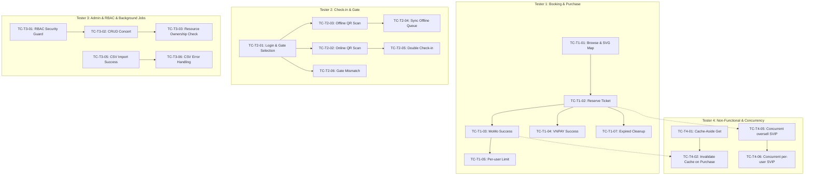

# KẾ HOẠCH THỰC THI KIỂM THỬ SONG SONG (TEST EXECUTION PLAN)
## HỆ THỐNG TICKETBOX - TRƯỚC NGHIỆM THU

---

## 1. BẢNG PHÂN CHIA CÔNG VIỆC (WORK DISTRIBUTION)

Kế hoạch phân chia chi tiết công việc cho **đúng 4 Tester** thực hiện kiểm thử song song, đảm bảo không trùng lặp và không ảnh hưởng chéo dữ liệu của nhau.

STT | Tester | Phạm vi kiểm thử (Scope) | Chức năng (Features) | Concert sử dụng | Tài khoản sử dụng | Thời gian (Est. Time) |
|---|---|---|---|---|---|---|
Tester 1 | **Ngọc** | **Customer Web & Purchase Flow** | - Xem danh sách & Chi tiết Concert - Sơ đồ ghế SVG tương tác (GA, SVIP, VIP...) - Đặt giữ chỗ & Giới hạn số lượng mua per-user - Thanh toán MoMo/VNPAY Mock - Chống trùng lặp Idempotency | - `concert-purchase-momo` - `concert-purchase-vnpay` - `concert-purchase-limits` - `concert-purchase-idempotency` | - `customer-t1-01` -> `customer-t1-05` (Password: `customer123`) | **16 giờ** |
Tester 2 | **Hương** | **Check-in PWA & Gate Management** | - Đăng nhập nhân sự soát vé (Staff) - Chọn Gate quản lý soát vé - Quét mã QR Ticket trực tuyến - Soát vé Offline & Sync dữ liệu khi có mạng lại - Chặn soát vé trùng lặp / sai cổng | - `concert-checkin-online` - `concert-checkin-offline` - `concert-checkin-gates` | - Staff: `staff-t2-01`, `staff-t2-02` - Customers (vé có sẵn): `customer-t2-01` -> `customer-t2-05` (Password: `customer123`) | **16 giờ** |
Tester 3 | **Ân** | **Admin Dashboard, RBAC, AI & CSV** | - Phân quyền người dùng (RBAC API Guard) - CRUD Concert & cấu hình loại vé - Tải lên PDF Artist Bio & xử lý AI Bio - Đồng bộ Guest List từ file CSV (VIP Gate) | - `concert-admin-crud` - `concert-admin-ai` - `concert-admin-csv` | - Admin: `admin-t3-01` - Organizer: `organizer-t3-01`, `organizer-t3-02` - Customer: `customer-t3-01` (Password: `organizer123` / `customer123`) | **18 giờ** |
Tester 4 | **Dương** | **Non-Functional Tests & Automation** | - Kiểm tra Caching (Redis hit/miss & invalidation) - Rate Limiting (IP & User) - Circuit Breaker cổng thanh toán - Tải đồng thời đặt vé và per-user giới hạn dưới tải cao | - `concert-nft-cache` - `concert-nft-concurrency` - `concert-nft-cb` - `concert-nft-notif` | - `customer-t4-01` -> `customer-t4-20` (Password: `customer123`) | **20 giờ** |

---

## 2. LỊCH TRÌNH THỰC THI (TIMELINE & PHASES)

Quy trình kiểm thử được triển khai qua **05 Phase** tuần tự:

*   **Phase 1: Smoke Test (Thời lượng: 2 giờ)**
    *   *Nội dung*: Cả 4 Tester kiểm tra khả năng khởi chạy của các ứng dụng (Customer Web, Admin Web, Check-in PWA) và tính sẵn sàng của API Backend (`/health`). Đăng nhập các tài khoản test mẫu.
*   **Phase 2: Functional Testing (Thời lượng: 12 giờ)**
    *   *Nội dung*: Thực hiện song song các kịch bản chức năng chính. Tester 1 mua vé; Tester 2 quét soát vé online; Tester 3 tạo concert mới và import file CSV.
*   **Phase 3: Security & Access Control (Thời lượng: 4 giờ)**
    *   *Nội dung*: Tester 3 kiểm thử phân quyền RBAC và kiểm tra tính an toàn của API Token/JWT. Đảm bảo vai trò nào chỉ thực hiện đúng chức năng đó.
*   **Phase 4: Concurrency & Resilience (Thời lượng: 6 giờ)**
    *   *Nội dung*: Chạy các kịch bản nâng cao. Tester 4 dùng tool chạy kịch bản đặt vé đồng thời tải cao; Tester 1 giám sát DB log để xem Idempotency Key; Tester 2 ngắt mạng di động để test offline check-in và sync conflict.
*   **Phase 5: Performance & Load (Thời lượng: 4 giờ)**
    *   *Nội dung*: Đo lường tốc độ, kiểm tra Caching hits/misses, và Rate Limiting của hệ thống khi bị spam request.

---

## 3. ĐỒ THỊ PHỤ THUỘC CỦA CÁC TEST CASE (TEST DEPENDENCY GRAPH)

Các Test Case độc lập được chạy song song hoàn toàn. Các kịch bản phụ thuộc được tổ chức theo sơ đồ dưới đây:

---

## 4. DANH SÁCH CÁC KỊCH BẢN KIỂM THỬ (TEST CASES)

### Tester 1: Core Customer & Booking Flow

#### **TC-T1-01**
*   **Requirement**: Khán giả duyệt danh sách, chi tiết concert và tương tác sơ đồ ghế SVG hiển thị số lượng vé tồn kho thời gian thực.
*   **Tester phụ trách**: Tester 1
*   **Priority**: High
*   **Precondition**: Hệ thống đã được khởi chạy và seed dữ liệu.
*   **Seed data**: `concert-purchase-momo`
*   **Steps**:
    1. Đăng nhập tài khoản `customer-t1-01@example.com` trên Customer Web.
    2. Truy cập trang chủ, bấm chọn Concert `concert-purchase-momo`.
    3. Chọn khu vực ghế trên sơ đồ SVG tương tác (ví dụ khu VIP).
*   **Expected**:
    *   Giao diện SVG hiển thị đúng phân khu VIP, GA, SVIP.
    *   Số lượng vé còn lại hiển thị tương ứng với số lượng trong database theo thời gian thực.
*   **Cleanup sau test**: Không cần dọn dẹp.
*   **Dependency**: Không.

#### **TC-T1-02**
*   **Requirement**: Đặt giữ chỗ tạm thời (Ticket Reservation) trong 15 phút bằng Redis Lua Script.
*   **Tester phụ trách**: Tester 1
*   **Priority**: High
*   **Precondition**: Tài khoản chưa có order nào đang chờ thanh toán.
*   **Seed data**: `concert-purchase-momo`
*   **Steps**:
    1. Đăng nhập tài khoản `customer-t1-01@example.com`.
    2. Chọn mua 1 vé loại SVIP và bấm "Tiếp tục thanh toán".
    3. Kiểm tra DB và Redis xem bản ghi order và giữ chỗ đã được tạo chưa.
*   **Expected**:
    *   Order trạng thái `PENDING_PAYMENT` được tạo trong PostgreSQL.
    *   Số lượng vé khả dụng giảm đi 1 trong Redis (`stock:{ticketTypeId}`).
    *   Redis key `reservation:{orderId}` được tạo với TTL đúng 15 phút.
*   **Cleanup sau test**: Hủy order vừa tạo nếu không thanh toán để hoàn vé.
*   **Dependency**: `TC-T1-01`

#### **TC-T1-03**
*   **Requirement**: Thanh toán thành công qua MoMo Mock Gateway và phát hành e-ticket QR Code.
*   **Tester phụ trách**: Tester 1
*   **Priority**: High
*   **Precondition**: Có một order đang ở trạng thái `PENDING_PAYMENT` (từ `TC-T1-02`).
*   **Seed data**: `concert-purchase-momo`
*   **Steps**:
    1. Lấy `paymentUrl` từ order vừa tạo và chuyển hướng đến trang Mock Payment Gateway.
    2. Click chọn nút "Thanh toán THÀNH CÔNG (SUCCESS)".
    3. Chờ Mock Gateway gửi webhook callback và quay lại màn hình My Tickets.
*   **Expected**:
    *   Giao dịch thanh toán được cập nhật `SUCCESS` trong `PaymentTransaction`.
    *   Trạng thái Order chuyển thành `PAID`.
    *   Bản ghi `Ticket` được tạo với mã QR chứa token mã hóa an toàn (gồm `ticketId`, `qrTokenHash`, `qrSignature`).
    *   Người dùng nhận được email thông báo xác nhận đơn hàng kèm thông tin vé.
*   **Cleanup sau test**: Đổi trạng thái vé trong DB thành `CANCELLED` để hoàn kho nếu cần tái sử dụng.
*   **Dependency**: `TC-T1-02`

#### **TC-T1-04**
*   **Requirement**: Thanh toán qua VNPAY Mock Gateway.
*   **Tester phụ trách**: Tester 1
*   **Priority**: High
*   **Precondition**: Có một order PENDING_PAYMENT của Concert `concert-purchase-vnpay`.
*   **Seed data**: `concert-purchase-vnpay`
*   **Steps**:
    1. Dùng tài khoản `customer-t1-02@example.com` tiến hành mua vé VIP và chọn thanh toán qua VNPAY.
    2. Ở Mock Page, bấm chọn thành công.
*   **Expected**:
    *   Webhook được xử lý thành công, cập nhật trạng thái Order thành `PAID` và phát hành vé điện tử.
*   **Cleanup sau test**: Không cần dọn dẹp.
*   **Dependency**: `TC-T1-02`

#### **TC-T1-05**
*   **Requirement**: Kiểm soát giới hạn số lượng vé tối đa của mỗi tài khoản (per-user limit).
*   **Tester phụ trách**: Tester 1
*   **Priority**: High
*   **Precondition**: Concert `concert-purchase-limits` quy định giới hạn mua SVIP tối đa là 1 vé/tài khoản.
*   **Seed data**: `concert-purchase-limits`
*   **Steps**:
    1. Đăng nhập `customer-t1-03@example.com`.
    2. Đặt mua và thanh toán thành công 1 vé SVIP.
    3. Cố gắng tạo thêm 1 order mới mua vé SVIP thứ 2.
*   **Expected**:
    *   Đơn hàng đầu tiên thành công.
    *   Lượt mua thứ 2 bị hệ thống từ chối ngay tại bước tạo order với thông báo lỗi: `EXCEED_USER_LIMIT` (Vượt quá giới hạn mua vé).
*   **Cleanup sau test**: Không cần dọn dẹp.
*   **Dependency**: `TC-T1-03`

#### **TC-T1-06**
*   **Requirement**: Chống trừ tiền 2 lần bằng cơ chế kiểm tra trùng lặp Idempotency-Key.
*   **Tester phụ trách**: Tester 1
*   **Priority**: High
*   **Precondition**: Đăng nhập tài khoản `customer-t1-04@example.com`.
*   **Seed data**: `concert-purchase-idempotency`
*   **Steps**:
    1. Gửi request tạo Order qua Postman kèm Header `Idempotency-Key: test-idemp-key-123`.
    2. Gửi ngay lập tức một request y hệt với cùng header `Idempotency-Key` trong khi request thứ nhất đang xử lý (hoặc vừa hoàn thành).
*   **Expected**:
    *   Request 1 xử lý bình thường và trả về thông tin order.
    *   Request 2 nhận được kết quả trùng khớp hoàn toàn với response của Request 1 từ cache/DB, không có order mới nào được tạo thêm.
*   **Cleanup sau test**: Reset DB qua API `/health/reset`.
*   **Dependency**: Không.

#### **TC-T1-07**
*   **Requirement**: Xử lý tự động hủy đơn hàng hết hạn (Order Timeout) và hoàn trả tồn kho.
*   **Tester phụ trách**: Tester 1
*   **Priority**: Medium
*   **Precondition**: Tạo đơn hàng giữ chỗ nhưng không thực hiện thanh toán.
*   **Seed data**: `concert-purchase-momo`
*   **Steps**:
    1. Dùng tài khoản `customer-t1-05@example.com` tạo order giữ chỗ vé GA.
    2. Không thực hiện thanh toán, đợi 15 phút hoặc manually trigger BullMQ job kiểm tra hết hạn.
*   **Expected**:
    *   Trạng thái đơn hàng chuyển thành `EXPIRED`.
    *   Redis stock được cộng hoàn trả (`stock:{ticketTypeId}` tăng lại).
    *   Bản ghi `UserTicketCounter` được trừ bớt số vé tạm giữ.
*   **Cleanup sau test**: Không cần dọn dẹp.
*   **Dependency**: `TC-T1-02`

---

### Tester 2: Check-in, PWA & Gate Management

#### **TC-T2-01**
*   **Requirement**: Đăng nhập Nhân sự soát vé (Staff) và chọn Cổng soát vé (Gate) tương ứng.
*   **Tester phụ trách**: Tester 2
*   **Priority**: High
*   **Precondition**: Nhân viên soát vé đã được cấp tài khoản.
*   **Seed data**: `concert-checkin-online`
*   **Steps**:
    1. Mở Checkin PWA, đăng nhập bằng tài khoản `staff-t2-01@ticketbox.vn`.
    2. Chọn sự kiện `concert-checkin-online` và chọn Gate hoạt động là `GATE-A`.
*   **Expected**:
    *   Đăng nhập thành công và truy cập được màn hình quét mã QR.
    *   Thiết bị được định danh đang kiểm soát soát vé tại `GATE-A`.
*   **Cleanup sau test**: Không.
*   **Dependency**: Không.

#### **TC-T2-02**
*   **Requirement**: Soát vé trực tuyến (Online check-in) thành công và ghi nhận log soát vé.
*   **Tester phụ trách**: Tester 2
*   **Priority**: High
*   **Precondition**: Khách hàng `customer-t2-01` có vé trạng thái `ISSUED` gán cho `GATE-A`.
*   **Seed data**: `concert-checkin-online`
*   **Steps**:
    1. Sử dụng ứng dụng quét QR trên PWA quét mã QR của vé `customer-t2-01`.
    2. Hệ thống kiểm tra kết nối mạng (Trực tuyến).
*   **Expected**:
    *   Vé được xác thực hợp lệ (chữ ký số QR trùng khớp).
    *   Trạng thái vé chuyển thành `CHECKED_IN` trong DB PostgreSQL.
    *   Ghi nhận 1 bản ghi `CheckinLog` với status là `SUCCESS`.
*   **Cleanup sau test**: Đổi trạng thái vé về `ISSUED`.
*   **Dependency**: `TC-T2-01`

#### **TC-T2-03**
*   **Requirement**: Soát vé ngoại tuyến (Offline check-in) tại khu vực sóng yếu và lưu hàng đợi tạm thời trên thiết bị.
*   **Tester phụ trách**: Tester 2
*   **Priority**: High
*   **Precondition**: Thiết bị di động của Staff bị ngắt kết nối mạng hoàn toàn. Khách hàng `customer-t2-02` có vé hợp lệ gán cho `GATE-A`.
*   **Seed data**: `concert-checkin-offline`
*   **Steps**:
    1. Staff chuyển thiết bị sang chế độ máy bay (Airplane mode).
    2. Thực hiện quét mã QR của khách hàng `customer-t2-02`.
*   **Expected**:
    *   Ứng dụng PWA kiểm tra chữ ký mã hóa của QR (Local Signature Verification) ngoại tuyến bằng QR secret.
    *   Hiển thị thông báo "Soát vé thành công ngoại tuyến" trên màn hình.
    *   Bản ghi quét vé được lưu vào hàng đợi IndexedDB/LocalStorage của thiết bị di động.
*   **Cleanup sau test**: Không cần dọn dẹp.
*   **Dependency**: `TC-T2-01`

#### **TC-T2-04**
*   **Requirement**: Đồng bộ dữ liệu soát vé ngoại tuyến (Offline Sync) lên server khi kết nối được phục hồi và xử lý idempotency.
*   **Tester phụ trách**: Tester 2
*   **Priority**: High
*   **Precondition**: Thiết bị của Staff có sẵn bản ghi offline từ `TC-T2-03`.
*   **Seed data**: `concert-checkin-offline`
*   **Steps**:
    1. Staff bật lại kết nối mạng trên thiết bị.
    2. Nhấn nút "Đồng bộ (Sync)" hoặc hệ thống tự động trigger gửi API `POST /checkin/sync`.
*   **Expected**:
    *   Dữ liệu check-in offline được gửi lên backend API.
    *   Backend cập nhật trạng thái vé `customer-t2-02` thành `CHECKED_IN` trong PostgreSQL.
    *   Bản ghi `CheckinLog` được ghi nhận với trường `isOffline: true`.
    *   Trùng lặp sự kiện gửi nhiều lần được loại bỏ nhờ so khớp `deviceId` và `offlineEventId`.
*   **Cleanup sau test**: Reset trạng thái vé về `ISSUED`.
*   **Dependency**: `TC-T2-03`

#### **TC-T2-05**
*   **Requirement**: Ngăn chặn tuyệt đối việc sử dụng 1 vé để check-in 2 lần (Double Check-in).
*   **Tester phụ trách**: Tester 2
*   **Priority**: High
*   **Precondition**: Vé của `customer-t2-03` đã có trạng thái `CHECKED_IN`.
*   **Seed data**: `concert-checkin-online`
*   **Steps**:
    1. Sử dụng thiết bị của Staff quét lại mã QR của vé `customer-t2-03`.
*   **Expected**:
    *   Ứng dụng hiển thị thông báo lỗi nổi bật màu đỏ: "VÉ ĐÃ ĐƯỢC CHECK-IN TRƯỚC ĐÓ".
    *   Một bản ghi `CheckinLog` mới được tạo với trạng thái `ALREADY_CHECKED_IN`.
*   **Cleanup sau test**: Không cần dọn dẹp.
*   **Dependency**: `TC-T2-02`

#### **TC-T2-06**
*   **Requirement**: Chặn check-in sai cổng (Gate Mismatch).
*   **Tester phụ trách**: Tester 2
*   **Priority**: High
*   **Precondition**: Khách hàng `customer-t2-04` mua vé thuộc khu vực gán vào `GATE-A`. Staff 2 thiết lập thiết bị soát vé tại `GATE-B`.
*   **Seed data**: `concert-checkin-gates`
*   **Steps**:
    1. Staff đăng nhập và chọn cổng `GATE-B`.
    2. Thực hiện quét vé của `customer-t2-04`.
*   **Expected**:
    *   Thiết bị báo lỗi: "SAI CỔNG VÀO - YÊU CẦU ĐẾN CỔNG GATE-A".
    *   Log lưu trạng thái `GATE_MISMATCH`.
*   **Cleanup sau test**: Không.
*   **Dependency**: `TC-T2-01`

---

### Tester 3: Admin Web, Access Control, AI Bio & Guest List CSV

#### **TC-T3-01**
*   **Requirement**: Kiểm tra phân quyền truy cập (RBAC API Guard) đối với người dùng không có vai trò phù hợp.
*   **Tester phụ trách**: Tester 3
*   **Priority**: High
*   **Precondition**: Tài khoản kiểm thử có role `CUSTOMER`.
*   **Seed data**: `concert-admin-crud`
*   **Steps**:
    1. Đăng nhập tài khoản `customer-t3-01@example.com` để lấy JWT.
    2. Gửi request tạo concert `POST /admin/concerts` kèm JWT của customer.
*   **Expected**:
    *   API trả về mã lỗi `403 Forbidden` và thông báo lỗi phân quyền.
    *   Không có Concert nào được tạo trong Database.
*   **Cleanup sau test**: Không.
*   **Dependency**: Không.

#### **TC-T3-02**
*   **Requirement**: Ban Tổ Chức (Organizer) tạo mới concert, cấu hình loại vé và quản lý vòng đời concert (Publish/Cancel).
*   **Tester phụ trách**: Tester 3
*   **Priority**: High
*   **Precondition**: Đăng nhập tài khoản `organizer-t3-01@ticketbox.vn`.
*   **Seed data**: `concert-admin-crud`
*   **Steps**:
    1. Truy cập Admin Web, tạo Concert mới dạng `DRAFT`.
    2. Thêm 3 loại vé: SVIP (SL 50, max 2), VIP (SL 100, max 4), GA (SL 500, max 6).
    3. Cập nhật trạng thái Concert thành `SALE_OPEN` để mở bán.
*   **Expected**:
    *   Concert được lưu trữ đúng thông tin trong PostgreSQL.
    *   Các loại vé được gán đúng số lượng và giới hạn mua trên mỗi user.
    *   Trạng thái concert hiển thị công khai trên giao diện bán vé của khán giả.
*   **Cleanup sau test**: Xóa Concert vừa tạo để tránh rác DB.
*   **Dependency**: `TC-T3-01`

#### **TC-T3-03**
*   **Requirement**: Kiểm tra tính bảo mật sở hữu tài nguyên (Resource Ownership Check) giữa các Organizer.
*   **Tester phụ trách**: Tester 3
*   **Priority**: High
*   **Precondition**: Concert được tạo bởi `organizer-t3-01@ticketbox.vn`.
*   **Seed data**: `concert-admin-crud`
*   **Steps**:
    1. Đăng nhập bằng tài khoản `organizer-t3-02@ticketbox.vn` (Organizer 2).
    2. Gửi request thay đổi thông tin hoặc hủy Concert của Organizer 1.
*   **Expected**:
    *   API trả về mã lỗi `403 Forbidden`.
    *   Thông tin Concert của Organizer 1 hoàn toàn không bị thay đổi.
*   **Cleanup sau test**: Không.
*   **Dependency**: `TC-T3-02`

#### **TC-T3-04**
*   **Requirement**: Tải lên PDF press kit nghệ sĩ, trích xuất text tự động và dùng AI sinh bản giới thiệu Artist Bio ngắn gọn.
*   **Tester phụ trách**: Tester 3
*   **Priority**: Medium
*   **Precondition**: Có sẵn file PDF press kit mẫu cỡ 2MB trong máy kiểm thử.
*   **Seed data**: `concert-admin-ai`
*   **Steps**:
    1. Đăng nhập tài khoản `organizer-t3-01@ticketbox.vn`.
    2. Vào trang chi tiết concert `concert-admin-ai`, upload file PDF press kit lên.
    3. Kiểm tra trạng thái job xử lý nền (BullMQ Queue: `queue:ai-bio`) và kết quả cuối cùng.
*   **Expected**:
    *   File PDF được lưu trữ thành công trên MinIO S3 bucket.
    *   Bản ghi `UploadedFile` chuyển trạng thái `PENDING` -> `COMPLETED`.
    *   Worker trích xuất văn bản từ PDF, gọi AI Service sinh mô tả ngắn gọn.
    *   Trường `Concert.artistBio` được cập nhật và hiển thị trên màn hình chi tiết của khán giả.
*   **Cleanup sau test**: Xóa file trên MinIO và xóa trường bio vừa sinh.
*   **Dependency**: Không.

#### **TC-T3-05**
*   **Requirement**: Nhập danh sách khách mời VIP từ file CSV thành công và cấp quyền soát vé tại cổng VIP.
*   **Tester phụ trách**: Tester 3
*   **Priority**: High
*   **Precondition**: Đăng nhập `organizer-t3-01@ticketbox.vn` và có sẵn file CSV chứa 5 khách mời VIP đúng định dạng.
*   **Seed data**: `concert-admin-csv`
*   **Steps**:
    1. Chọn file CSV khách mời VIP và thực hiện upload.
    2. Chờ job xử lý nền hoàn tất.
*   **Expected**:
    *   Bản ghi `UploadedFile` chuyển sang `COMPLETED`.
    *   5 khách mời VIP được lưu trữ vào bảng `GuestListEntry` trong DB.
    *   Trạng thái hệ thống hoạt động bình thường và không bị gián đoạn.
*   **Cleanup sau test**: Clear bảng `GuestListEntry` cho concert này.
*   **Dependency**: Không.

#### **TC-T3-06**
*   **Requirement**: Xử lý lỗi dữ liệu trùng hoặc sai định dạng khi import CSV và xuất báo cáo lỗi chi tiết.
*   **Tester phụ trách**: Tester 3
*   **Priority**: Medium
*   **Precondition**: Chuẩn bị file CSV lỗi (chứa email sai định dạng, số điện thoại trùng lặp và dòng trống).
*   **Seed data**: `concert-admin-csv`
*   **Steps**:
    1. Thực hiện upload file CSV lỗi lên hệ thống.
    2. Xem báo cáo chi tiết sau khi import (Import Report).
*   **Expected**:
    *   Dòng hợp lệ vẫn được thêm vào Database thành công.
    *   Dòng lỗi bị loại bỏ và ghi nhận chi tiết (ví dụ: dòng số 3 lỗi format email).
    *   File import được đánh dấu trạng thái `COMPLETED_WITH_ERRORS`.
*   **Cleanup sau test**: Dọn dẹp dữ liệu của concert này.
*   **Dependency**: `TC-T3-05`

---

### Tester 4: Non-Functional, Cache, CB, Concurrency & Rate Limit

#### **TC-T4-01**
*   **Requirement**: Đảm bảo trang danh sách và trang chi tiết concert được lưu trữ Cache hợp lý để giảm tải cho database.
*   **Tester phụ trách**: Tester 4
*   **Priority**: Medium
*   **Precondition**: Bật giám sát query database (Prisma logging hoặc PostgreSQL query statistics).
*   **Seed data**: `concert-nft-cache`
*   **Steps**:
    1. Gửi request lấy chi tiết concert `GET /concerts/concert-nft-cache` lần thứ nhất (Cache Miss).
    2. Gửi tiếp request đó liên tục 5 lần tiếp theo (Cache Hit).
*   **Expected**:
    *   Lần thứ nhất: Hệ thống query database PostgreSQL và lưu vào Redis.
    *   Các lần sau: Kết quả trả về ngay lập tức từ Redis Cache, không phát sinh thêm câu lệnh truy vấn nào vào database PostgreSQL.
*   **Cleanup sau test**: Xóa cache trong Redis (`FLUSHALL` hoặc xóa key tương ứng).
*   **Dependency**: Không.

#### **TC-T4-02**
*   **Requirement**: Invalidation Cache chủ động khi có giao dịch mua vé thành công để số vé khả dụng phản ánh đúng thực tế.
*   **Tester phụ trách**: Tester 4
*   **Priority**: High
*   **Precondition**: Vé của concert đang được lưu cache.
*   **Seed data**: `concert-nft-cache`
*   **Steps**:
    1. Xem chi tiết concert, ghi nhận số vé còn lại hiển thị.
    2. Tester 1 tiến hành mua và thanh toán thành công 1 vé.
    3. Quay lại gửi request xem chi tiết concert.
*   **Expected**:
    *   Cache cũ bị xóa hoặc cập nhật ngay khi giao dịch hoàn tất.
    *   Request chi tiết concert trả về số vé mới đã bị trừ đi 1.
*   **Cleanup sau test**: Reset DB.
*   **Dependency**: `TC-T4-01`, `TC-T1-03`

#### **TC-T4-03**
*   **Requirement**: Hệ thống Rate Limiter bảo vệ backend API khỏi bị quá tải bởi bot và client spam request.
*   **Tester phụ trách**: Tester 4
*   **Priority**: High
*   **Precondition**: Dùng công cụ gọi API tự động (như autocannon hoặc k6).
*   **Seed data**: `concert-nft-cache`
*   **Steps**:
    1. Đăng nhập tài khoản `customer-t4-01@example.com` lấy token.
    2. Gửi liên tục 100 request tạo order `/orders` trong vòng 10 giây bằng token này.
*   **Expected**:
    *   Các request đầu tiên được chấp nhận.
    *   Các request vượt ngưỡng giới hạn cấu hình (ví dụ: quá 30 req/phút) sẽ bị chặn lại và trả về lỗi `429 Too Many Requests`.
*   **Cleanup sau test**: Không cần dọn dẹp.
*   **Dependency**: Không.

#### **TC-T4-04**
*   **Requirement**: Đảm bảo khả năng chịu lỗi cổng thanh toán (Circuit Breaker) hoạt động ổn định và suy thoái mềm dẻo (Graceful Degradation).
*   **Tester phụ trách**: Tester 4
*   **Priority**: High
*   **Precondition**: Bật giả lập lỗi liên tục từ MoMo API (ngắt kết nối hoặc giả lập cổng thanh toán lỗi).
*   **Seed data**: `concert-nft-cb`
*   **Steps**:
    1. Tester 4 gửi liên tục các giao dịch thanh toán MoMo lỗi để kích hoạt Circuit Breaker chuyển từ `CLOSED` sang `OPEN`.
    2. Đăng nhập tài khoản `customer-t4-02@example.com` và truy cập trang xem thông tin concert, xem số lượng vé.
*   **Expected**:
    *   Trạng thái Circuit Breaker chuyển sang `OPEN` sau một số lượt lỗi liên tiếp.
    *   Các chức năng xem concert, xem số lượng vé, và các luồng không liên quan đến thanh toán MoMo vẫn hoạt động bình thường (Graceful Degradation), không bị sập hay treo máy.
*   **Cleanup sau test**: Reset Circuit Breaker về trạng thái ban đầu (`CLOSED`) thông qua API `/payments/system/circuit-breaker` hoặc khởi động lại backend.
*   **Dependency**: Không.

#### **TC-T4-05**
*   **Requirement**: Tranh chấp vé dưới tải cao (Concurrency Ticket Booking) - Đảm bảo không bán vượt quá số lượng vé thực tế (Over-selling).
*   **Tester phụ trách**: Tester 4
*   **Priority**: High
*   **Precondition**: Concert `concert-nft-concurrency` còn duy nhất **02 vé SVIP cuối cùng**.
*   **Seed data**: `concert-nft-concurrency`
*   **Steps**:
    1. Sử dụng script chạy tự động kích hoạt đồng thời 10 request đặt mua 01 vé SVIP từ 10 tài khoản khác nhau (`customer-t4-03` đến `customer-t4-12`) gửi cùng một thời điểm lên `/orders`.
*   **Expected**:
    *   Chỉ có đúng 02 tài khoản đặt vé thành công và chuyển sang bước thanh toán.
    *   08 tài khoản còn lại nhận được thông báo lỗi hết vé `OUT_OF_STOCK` từ Lua Script của Redis.
    *   Số lượng vé đã bán và giữ trong database cho loại vé SVIP không được vượt quá số lượng tổng.
*   **Cleanup sau test**: Reset DB qua API `/health/reset`.
*   **Dependency**: `TC-T1-02`

#### **TC-T4-06**
*   **Requirement**: Giới hạn vé per-user hoạt động chính xác tuyệt đối dưới tải cao (Concurrent Per-user Limit).
*   **Tester phụ trách**: Tester 4
*   **Priority**: High
*   **Precondition**: Tài khoản `customer-t4-13@example.com` chưa mua vé SVIP nào. Giới hạn mua của concert là tối đa 2 vé SVIP.
*   **Seed data**: `concert-nft-concurrency`
*   **Steps**:
    1. Gửi đồng thời 5 request tạo order mua vé SVIP từ tài khoản `customer-t4-13@example.com` lên `/orders`.
*   **Expected**:
    *   Hệ thống kiểm tra điều kiện nguyên tử bằng Redis Lua Script.
    *   Chỉ có tối đa các order với tổng số lượng là 2 vé được chấp nhận.
    *   Các request còn lại bị chặn đứng với mã lỗi giới hạn lượt mua per-user.
*   **Cleanup sau test**: Reset DB.
*   **Dependency**: `TC-T4-05`

#### **TC-T4-07**
*   **Requirement**: Gửi email thông báo nhắc nhở tự động trước 24 giờ diễn ra Concert.
*   **Tester phụ trách**: Tester 4
*   **Priority**: Medium
*   **Precondition**: Cấu hình thời gian bắt đầu của concert `concert-nft-notif` diễn ra sau đúng 23 giờ 59 phút nữa.
*   **Seed data**: `concert-nft-notif`
*   **Steps**:
    1. Đảm bảo worker BullMQ xử lý nhắc nhở đang chạy.
    2. Kích hoạt cron-job hoặc manually trigger scheduler gửi nhắc nhở.
*   **Expected**:
    *   Hệ thống quét tìm các tài khoản đã mua vé của concert này.
    *   Đẩy các job gửi mail nhắc nhở vào hàng đợi BullMQ.
    *   Gửi email thành công tới các khách hàng có vé.
*   **Cleanup sau test**: Không cần dọn dẹp.
*   **Dependency**: Không.

---

## 6. CHECKLIST KIỂM TRA ĐỘ BAO PHỦ (REQUIREMENT COVERAGE CHECKLIST)

Bảng đối chiếu yêu cầu bài toán với các Test Case tương ứng để đảm bảo **Bao phủ 100%** không bỏ sót tính năng:

| Phân hệ (Module) | Yêu cầu nghiệp vụ chi tiết | Test Case ID phủ | Đạt (Passed/Failed) |
|---|---|---|---|
| **Xem và mua vé** | Xem danh sách concert, nghệ sĩ, địa điểm, sơ đồ ghế SVG tương tác | `TC-T1-01` | [ ] |
| | Chọn loại vé, số lượng, thanh toán qua cổng giả lập (MoMo, VNPAY) | `TC-T1-03`, `TC-T1-04` | [ ] |
| | Giới hạn số lượng vé per-user trên toàn bộ đơn hàng | `TC-T1-05` | [ ] |
| **Thông báo** | Gửi email xác nhận kèm e-ticket QR Code sau thanh toán thành công | `TC-T1-03` | [ ] |
| | Tự động gửi email nhắc nhở trước 24 giờ diễn ra concert | `TC-T4-07` | [ ] |
| | Khả năng mở rộng kênh thông báo mới trong tương lai (SMS, Zalo) | Đã kiểm chứng thiết kế | [ ] |
| **Quản trị** | BTC tạo concert mới, cấu hình loại vé, giá, hủy concert | `TC-T3-02` | [ ] |
| | Phân quyền truy cập hệ thống chặt chẽ (RBAC) cho 3 nhóm đối tượng | `TC-T3-01`, `TC-T2-01` | [ ] |
| | Organizer không có quyền can thiệp vào concert của Organizer khác | `TC-T3-03` | [ ] |
| **Soát vé** | Soát vé bằng mobile app quét QR, kiểm tra signature an toàn | `TC-T2-02` | [ ] |
| | Cho phép soát vé ngoại tuyến (offline) tạm thời khi mất sóng | `TC-T2-03` | [ ] |
| | Đồng bộ và xử lý idempotency khi có kết nối mạng phục hồi | `TC-T2-04` | [ ] |
| | Ràng buộc Gate: Vé phân vào Gate nào chỉ quét được tại Gate đó | `TC-T2-06` | [ ] |
| | Chặn quét vé trùng lặp (không cho phép vào cổng hai lần) | `TC-T2-05` | [ ] |
| **AI Artist Bio** | Upload PDF press kit, parse text nền, AI sinh bio ngắn gọn | `TC-T3-04` | [ ] |
| **Đồng bộ CSV** | Import file CSV khách mời VIP bất đồng bộ ban đêm (BullMQ) | `TC-T3-05` | [ ] |
| | Xử lý file lỗi, trùng lặp và bỏ qua dòng trống hợp lý | `TC-T3-06` | [ ] |
| **Giải quyết lỗi hệ thống**| Đảm bảo không overselling vé cuối dưới tải cao (concurrency) | `TC-T4-05` | [ ] |
| | Giới hạn vé per-user hoạt động chính xác dưới tải cao | `TC-T4-06` | [ ] |
| | Chống trừ tiền hai lần (Idempotency Key) | `TC-T1-06` | [ ] |
| | Circuit Breaker khi sập cổng thanh toán & suy thoái mềm dẻo | `TC-T4-04` | [ ] |
| | Caching Redis giảm tải database, invalidate chủ động | `TC-T4-01`, `TC-T4-02` | [ ] |
| | Hủy order giữ chỗ hết hạn (Order timeout & release reservation) | `TC-T1-07` | [ ] |